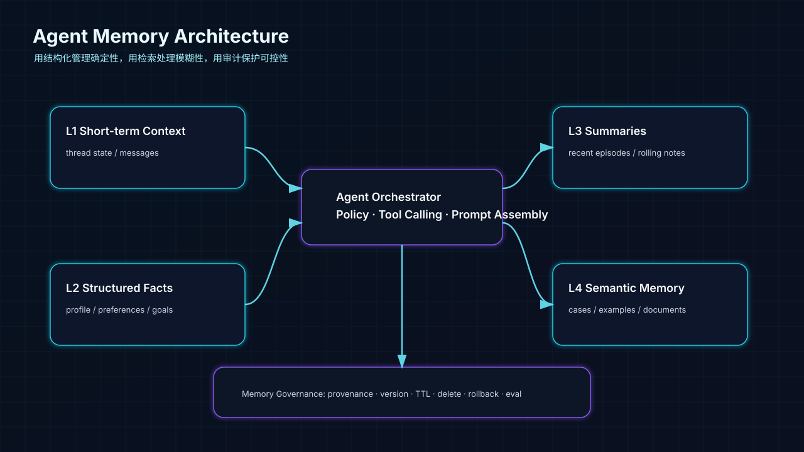
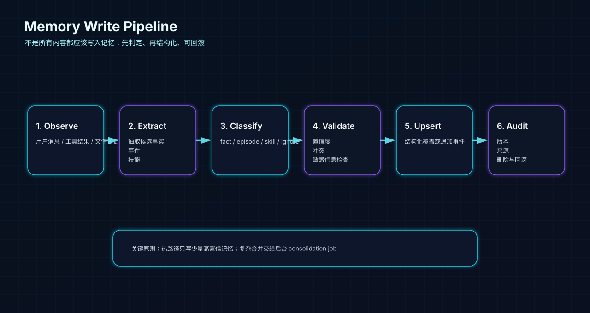
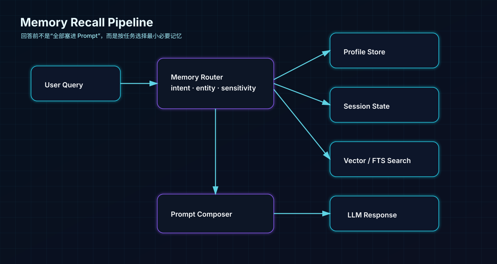
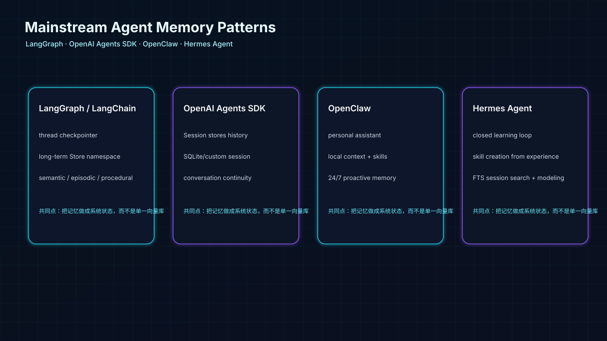

> **核心观点**：在构建 AI Agent 时，很多开发者的第一反应是“把所有历史记录存入向量数据库”。但真正的 Agent Memory 不是一个 Vector DB 表，而是一套**分层状态管理系统**：确定性事实用结构化存储，模糊经验用检索，长对话用摘要压缩，技能和偏好用可维护文档，所有写入都要有来源、版本和删除机制。

> **本文说明**：公开资料不会完整披露 ChatGPT 等商业系统的内部实现，因此本文不是“复刻某个闭源产品源码”，而是结合主流框架和工业实践，总结一套可落地的 Agent Memory 架构。


## 1. 为什么“所有历史都进向量库”会翻车？

在传统知识库问答中，向量数据库很强：你问“怎么处理退款争议”，它能召回语义相近的历史工单、政策文档、案例总结。

但用户记忆不是普通知识库。用户记忆里有很多**唯一、明确、会变化、需要覆盖**的事实。

### 1.1 更新悖论：旧事实和新事实会同时被召回

假设用户留下两条记录：

- 上周：“我的购车预算是 5 万。”
- 今天：“我加预算了，现在预算是 8 万。”

如果你把它们都 embedding 后扔进向量库，下次检索“预算”时，两条都可能被召回。模型看到：

```text
用户预算：5万
用户预算：8万
```

它可能会犹豫、混用，甚至错误地按旧预算回答。向量库的语义相似性解决的是“找相关”，不是“谁覆盖谁”。

**长期事实的正确做法是 UPSERT**：

```sql
INSERT INTO user_facts(user_id, key, value, updated_at)
VALUES ('u1', 'car_budget', '8万', now())
ON CONFLICT(user_id, key) DO UPDATE
SET value = excluded.value,
    updated_at = excluded.updated_at;
```

`car_budget` 对一个用户来说应该只有一个当前值，而不是 N 条相似历史。

### 1.2 事实匹配不能模糊化

这些信息适合结构化管理：

| 事实类型 | 例子 | 适合的存储 |
|---|---|---|
| 身份事实 | 姓名、职业、所在城市 | PostgreSQL / KV |
| 稳定偏好 | 不吃香菜、喜欢极简风格 | PostgreSQL / JSONB |
| 当前目标 | 求职方向、购车预算、旅行计划 | PostgreSQL / 状态表 |
| 敏感偏好 | 健康、财务、家庭信息 | 加密字段 + 权限控制 |

这些事实不能依赖“相似度”。你叫张三，系统绝不能因为语义相近召回李四；你预算已经改成 8 万，系统也不能继续按 5 万推荐。

## 2. 工业级 Agent Memory：不是一个模块，而是一套系统

一个更可靠的 Agent Memory 通常至少包含下面几层。

### Layer 1：Short-term Context，当前上下文

**定位**：当前会话内的短期记忆。

**典型实现**：

- 最近 N 轮消息滑动窗口
- 当前任务 state
- 当前工具调用中间结果
- 当前上传文件、临时变量、草稿内容

**关键点**：短期上下文是 thread/session scoped，不应该默认跨会话污染。LangGraph 的文档也把短期记忆描述为 thread-scoped state，并通过 checkpointer 持久化到数据库，方便同一线程恢复。官方文档还强调长上下文会带来成本、速度和注意力分散问题，因此需要主动过滤或遗忘过期消息。

### Layer 2：Long-term Facts，结构化长期事实

**定位**：跨会话稳定存在、可更新、可查询的用户事实。

**典型实现**：

- PostgreSQL / MySQL 表
- Redis / KV Store
- JSONB profile
- 带版本的 profile store

**适合保存**：

```json
{
  "name": "陈常超",
  "career_target": "AI Agent 全栈开发工程师",
  "tech_stack": ["TypeScript", "Python", "PostgreSQL", "RAG"],
  "job_city_preference": ["南京", "上海", "杭州", "苏州"]
}
```

**核心能力**：

- `UPSERT`：新事实覆盖旧事实。
- `versioning`：保留变更历史，必要时回滚。
- `provenance`：知道事实来自哪一次对话、哪个工具、哪个文件。
- `policy`：敏感记忆需要用户授权、可删除、可导出。

### Layer 3：Recent Summarization，近期摘要

**定位**：把冗长对话压缩成轻量上下文。

适合存：

- 最近正在推进的任务
- 最近几次对话的决策
- 尚未完成的 todo
- 最近项目状态

摘要记忆不是事实库，也不是向量库。它更像“会议纪要”：保留上下文，但不保证每个细节都精确。比如：

```text
最近用户正在准备智慧芽 AI Agent 岗位面试，重点补充 Patent FTO Agent Demo、VOC Agent 项目和个人网站项目页。
```

### Layer 4：Semantic / Episodic Memory，语义经验检索

**定位**：历史经验、案例、工单、项目片段、失败尝试。

适合向量检索的不是“当前预算是多少”，而是：

- 过去解决过的相似 Bug
- 过往客服工单和处理方案
- 用户过去喜欢的写作风格样例
- Agent 过去完成任务的轨迹
- VOC 评论片段、产品问题证据

这时向量库的优势才真正发挥出来：**不是读唯一事实，而是找相似经验。**

## 3. 写入链路：不是所有内容都应该被记住

记忆写入比记忆读取更危险。读取错了只是回答不准；写错了会污染未来很多轮对话。



一个稳妥的写入链路应该是：

1. **Observe**：收集用户消息、工具结果、文件变化。
2. **Extract**：抽取候选事实、事件、偏好、技能。
3. **Classify**：判断是 fact、episode、semantic、skill，还是 ignore。
4. **Validate**：做置信度、冲突、敏感信息和安全检查。
5. **Upsert / Append**：结构化事实覆盖，事件和经验追加。
6. **Audit**：记录来源、旧值、新值、时间、版本、可回滚。

我个人建议：

> 热路径只写少量高置信事实；复杂记忆合并放到后台任务里做。

比如用户说：“我准备投智慧芽，全栈 Agent 岗。”

热路径可以写入：

```json
{
  "career_target_company": "智慧芽",
  "career_target_role": "AI Agent 全栈工程师"
}
```

但不要立刻把整段对话都塞进长期记忆。更合理的是后台异步总结：

```text
用户正在准备智慧芽 AI Agent 岗位，关注 Patent FTO、RAG、Agent Workflow、Demo 和简历优化。
```

## 4. 召回链路：回答前只取“最小必要记忆”

很多 Agent 失败不是因为没有记忆，而是因为把太多无关记忆塞进 Prompt。



一个靠谱的召回链路通常是：

1. **理解当前任务**：这是求职建议、代码生成、情感支持、还是数据分析？
2. **识别实体和时间范围**：用户、项目、公司、最近/历史。
3. **选择记忆源**：profile、session state、summary、vector search、tool state。
4. **过滤敏感和无关内容**。
5. **组装最小 Prompt Memory Block**。
6. **生成回答，并记录使用过哪些记忆来源**。

可以把召回想象成一个 Router：

```text
用户问：“我现在投智慧芽岗位，简历怎么改？”

Memory Router：
- 需要 career_target、tech_stack、recent_resume_version
- 需要最近关于智慧芽岗位的上下文摘要
- 不需要用户家庭信息、健康信息、旧的相亲聊天记录
```

这也是长期记忆系统里的安全边界：**记忆不是有就用，而是该用才用。**

## 5. Python 最小实现：SQLite 版分层记忆系统

下面这段代码演示：

- 当前会话消息如何保存为 short-term context；
- 用户预算如何通过结构化 facts 做覆盖；
- 会话经历如何追加到 episodic memory；
- 如何用 SQLite FTS5 模拟语义召回；
- 如何用 audit log 记录每一次记忆写入。

完整文件可保存为 `memory_agent_demo.py`。

```python
"""
分层 Agent Memory 最小可运行 Demo
=================================

这个脚本演示一个“工业级 Agent 记忆系统”的最小骨架：

1. short-term context：当前会话最近 N 轮消息，适合即时上下文。
2. structured facts：长期稳定事实，用 SQLite 表做 UPSERT，解决“预算从 5 万更新到 8 万”的覆盖问题。
3. episodic summary：把会话压缩成摘要，避免把所有历史消息塞进 Prompt。
4. semantic memory：用 SQLite FTS5 模拟语义/关键词召回，实际生产可以换成 pgvector、Milvus、Qdrant 等。
5. audit log：每一次写入都留下来源和版本，方便回滚、解释和合规审计。

运行方式：
    python memory_agent_demo.py

说明：
    为了让代码不依赖外部 API，这里用规则函数 mock 了“LLM 抽取事实”的过程。
    在真实项目中，你可以把 extract_memory_candidates() 替换成 DeepSeek / OpenAI / Qwen 的 tool calling 输出。
"""

from __future__ import annotations

import json
import re
import sqlite3
from dataclasses import dataclass
from datetime import datetime, timezone
from pathlib import Path
from typing import Iterable, Literal, Optional

DB_PATH = Path("agent_memory_demo.sqlite3")

MemoryType = Literal["fact", "episode", "semantic"]


def utc_now() -> str:
    """统一用 UTC 时间，方便跨服务、跨时区排查问题。"""
    return datetime.now(timezone.utc).isoformat(timespec="seconds")


@dataclass
class MemoryCandidate:
    """
    LLM 或规则引擎从对话中抽取出的“候选记忆”。

    memory_type:
        fact     = 稳定事实，如预算、职业、偏好。适合结构化 UPSERT。
        episode  = 一次经历或任务上下文，如“上周看过 A 方案”。适合追加。
        semantic = 可复用经验，如“某类问题的解决方法”。适合检索。
    key:
        结构化事实的键名。episode / semantic 也可以用主题名。
    value:
        记忆正文。
    confidence:
        抽取置信度。低置信度不直接写入长期记忆。
    source:
        来源，方便审计。生产环境可记录 message_id / trace_id / tool_call_id。
    """

    memory_type: MemoryType
    key: str
    value: str
    confidence: float
    source: str


class MemoryStore:
    """分层记忆存储：SQLite 版本，便于本地演示。"""

    def __init__(self, db_path: Path = DB_PATH) -> None:
        self.db_path = db_path
        self.conn = sqlite3.connect(db_path)
        self.conn.row_factory = sqlite3.Row
        self.init_schema()

    def init_schema(self) -> None:
        """创建四类表：会话消息、结构化事实、片段记忆、审计日志。"""
        cur = self.conn.cursor()

        cur.execute(
            """
            CREATE TABLE IF NOT EXISTS conversation_messages (
                id INTEGER PRIMARY KEY AUTOINCREMENT,
                session_id TEXT NOT NULL,
                role TEXT NOT NULL,
                content TEXT NOT NULL,
                created_at TEXT NOT NULL
            );
            """
        )

        # structured facts：关键设计是 (user_id, key) 唯一，方便 UPSERT 覆盖旧值。
        cur.execute(
            """
            CREATE TABLE IF NOT EXISTS user_facts (
                user_id TEXT NOT NULL,
                key TEXT NOT NULL,
                value TEXT NOT NULL,
                confidence REAL NOT NULL,
                source TEXT NOT NULL,
                updated_at TEXT NOT NULL,
                PRIMARY KEY (user_id, key)
            );
            """
        )

        # episodic memory：保留时间线，不覆盖。
        cur.execute(
            """
            CREATE TABLE IF NOT EXISTS memory_events (
                id INTEGER PRIMARY KEY AUTOINCREMENT,
                user_id TEXT NOT NULL,
                memory_type TEXT NOT NULL,
                topic TEXT NOT NULL,
                content TEXT NOT NULL,
                confidence REAL NOT NULL,
                source TEXT NOT NULL,
                created_at TEXT NOT NULL
            );
            """
        )

        # FTS5：用全文检索模拟“语义召回”。生产中可以替换成 embedding + vector DB。
        cur.execute(
            """
            CREATE VIRTUAL TABLE IF NOT EXISTS memory_events_fts
            USING fts5(content, topic, content='memory_events', content_rowid='id');
            """
        )

        # audit log：工业系统非常重要。没有审计，就很难解释“模型为什么记住了这个”。
        cur.execute(
            """
            CREATE TABLE IF NOT EXISTS memory_audit_log (
                id INTEGER PRIMARY KEY AUTOINCREMENT,
                user_id TEXT NOT NULL,
                action TEXT NOT NULL,
                memory_type TEXT NOT NULL,
                key TEXT NOT NULL,
                old_value TEXT,
                new_value TEXT,
                source TEXT NOT NULL,
                created_at TEXT NOT NULL
            );
            """
        )

        self.conn.commit()

    def add_message(self, session_id: str, role: str, content: str) -> None:
        self.conn.execute(
            """
            INSERT INTO conversation_messages(session_id, role, content, created_at)
            VALUES (?, ?, ?, ?)
            """,
            (session_id, role, content, utc_now()),
        )
        self.conn.commit()

    def get_short_context(self, session_id: str, limit: int = 6) -> list[dict]:
        """读取当前会话最近 N 条消息，作为 short-term context。"""
        rows = self.conn.execute(
            """
            SELECT role, content, created_at
            FROM conversation_messages
            WHERE session_id = ?
            ORDER BY id DESC
            LIMIT ?
            """,
            (session_id, limit),
        ).fetchall()
        return [dict(r) for r in reversed(rows)]

    def upsert_fact(self, user_id: str, c: MemoryCandidate) -> None:
        """
        写入长期事实。

        这是本文最核心的地方：
        - 向量库会把“5万预算”和“8万预算”都留下；
        - 结构化事实表通过 PRIMARY KEY(user_id, key) 做覆盖，保证当前事实唯一。
        """
        old = self.conn.execute(
            "SELECT value FROM user_facts WHERE user_id = ? AND key = ?",
            (user_id, c.key),
        ).fetchone()
        old_value = old["value"] if old else None

        self.conn.execute(
            """
            INSERT INTO user_facts(user_id, key, value, confidence, source, updated_at)
            VALUES (?, ?, ?, ?, ?, ?)
            ON CONFLICT(user_id, key) DO UPDATE SET
                value = excluded.value,
                confidence = excluded.confidence,
                source = excluded.source,
                updated_at = excluded.updated_at
            """,
            (user_id, c.key, c.value, c.confidence, c.source, utc_now()),
        )
        self._audit(user_id, "UPSERT", "fact", c.key, old_value, c.value, c.source)
        self.conn.commit()

    def append_event(self, user_id: str, c: MemoryCandidate) -> None:
        """追加 episodic / semantic memory，不覆盖历史。"""
        cur = self.conn.execute(
            """
            INSERT INTO memory_events(user_id, memory_type, topic, content, confidence, source, created_at)
            VALUES (?, ?, ?, ?, ?, ?, ?)
            """,
            (user_id, c.memory_type, c.key, c.value, c.confidence, c.source, utc_now()),
        )
        row_id = cur.lastrowid
        self.conn.execute(
            "INSERT INTO memory_events_fts(rowid, content, topic) VALUES (?, ?, ?)",
            (row_id, c.value, c.key),
        )
        self._audit(user_id, "APPEND", c.memory_type, c.key, None, c.value, c.source)
        self.conn.commit()

    def _audit(
        self,
        user_id: str,
        action: str,
        memory_type: str,
        key: str,
        old_value: Optional[str],
        new_value: str,
        source: str,
    ) -> None:
        self.conn.execute(
            """
            INSERT INTO memory_audit_log(user_id, action, memory_type, key, old_value, new_value, source, created_at)
            VALUES (?, ?, ?, ?, ?, ?, ?, ?)
            """,
            (user_id, action, memory_type, key, old_value, new_value, source, utc_now()),
        )

    def get_facts(self, user_id: str) -> dict[str, str]:
        rows = self.conn.execute(
            "SELECT key, value FROM user_facts WHERE user_id = ? ORDER BY key",
            (user_id,),
        ).fetchall()
        return {r["key"]: r["value"] for r in rows}

    def search_events(self, user_id: str, query: str, limit: int = 5) -> list[dict]:
        """
        检索历史片段。

        这里用 FTS5 的 MATCH，适合演示。真实工程常见做法：
        - 关键词检索：PostgreSQL tsvector / Elasticsearch / OpenSearch
        - 向量检索：pgvector / Milvus / Qdrant / Pinecone
        - 混合检索：BM25 + vector + reranker
        """
        safe_query = " OR ".join(re.findall(r"[\w\u4e00-\u9fff]+", query))
        if not safe_query:
            return []
        rows = self.conn.execute(
            """
            SELECT e.id, e.memory_type, e.topic, e.content, e.created_at
            FROM memory_events_fts f
            JOIN memory_events e ON e.id = f.rowid
            WHERE memory_events_fts MATCH ? AND e.user_id = ?
            ORDER BY rank
            LIMIT ?
            """,
            (safe_query, user_id, limit),
        ).fetchall()
        return [dict(r) for r in rows]

    def apply_candidates(self, user_id: str, candidates: Iterable[MemoryCandidate]) -> None:
        """记忆写入策略：低置信度不写，高敏感数据应在这里做过滤。"""
        for c in candidates:
            if c.confidence < 0.75:
                continue
            if c.memory_type == "fact":
                self.upsert_fact(user_id, c)
            else:
                self.append_event(user_id, c)


def extract_memory_candidates(user_message: str, source: str) -> list[MemoryCandidate]:
    """用规则 mock LLM 的记忆抽取。真实系统里建议使用 tool calling。"""
    candidates: list[MemoryCandidate] = []

    budget_match = re.search(r"预算(?:是|增加到|改成|提高到)?\s*([0-9]+\s*万)", user_message)
    if budget_match:
        candidates.append(
            MemoryCandidate("fact", "car_budget", budget_match.group(1).replace(" ", ""), 0.95, source)
        )

    if "不喜欢太耗油" in user_message or "省油" in user_message:
        candidates.append(
            MemoryCandidate("fact", "car_preference", "偏好省油、低使用成本", 0.88, source)
        )

    if "看了一圈" in user_message or "试驾" in user_message:
        candidates.append(
            MemoryCandidate("episode", "car_purchase_research", f"用户购车调研进展：{user_message}", 0.82, source)
        )

    return candidates


def compose_prompt(store: MemoryStore, user_id: str, session_id: str, user_message: str) -> str:
    facts = store.get_facts(user_id)
    short_context = store.get_short_context(session_id, limit=4)
    related_events = store.search_events(user_id, user_message, limit=3)

    prompt = {
        "system": "你是一个购车顾问 Agent。回答时优先使用结构化事实，不要使用过期预算。",
        "structured_facts": facts,
        "short_context": short_context,
        "related_events": related_events,
        "user_message": user_message,
    }
    return json.dumps(prompt, ensure_ascii=False, indent=2)


def simulate_agent_turn(store: MemoryStore, user_id: str, session_id: str, user_message: str) -> None:
    print(f"\n👤 User: {user_message}")
    source = f"session:{session_id}:{utc_now()}"

    store.add_message(session_id, "user", user_message)
    candidates = extract_memory_candidates(user_message, source=source)
    store.apply_candidates(user_id, candidates)

    prompt = compose_prompt(store, user_id, session_id, user_message)
    print("\n🧠 Prompt Memory Block:")
    print(prompt)

    facts = store.get_facts(user_id)
    budget = facts.get("car_budget", "未知")
    preference = facts.get("car_preference", "暂无明确偏好")
    answer = f"我会按当前预算 {budget} 来推荐，并考虑你的偏好：{preference}。"
    store.add_message(session_id, "assistant", answer)
    print(f"\n🤖 Agent: {answer}")


def main() -> None:
    if DB_PATH.exists():
        DB_PATH.unlink()

    store = MemoryStore(DB_PATH)
    user_id = "user_chen"
    session_id = "thread_car_001"

    simulate_agent_turn(store, user_id, session_id, "我打算买辆车，目前预算是5万左右，不喜欢太耗油。")
    simulate_agent_turn(store, user_id, session_id, "昨天看了一圈，感觉配置太低了，我把预算增加到8万吧。")
    simulate_agent_turn(store, user_id, session_id, "那你按我现在的预算，给我推荐方案。")


if __name__ == "__main__":
    main()
```
输出如下：
```md
// demo_output.txt
👤 User: 我打算买辆车，目前预算是5万左右，不喜欢太耗油。

🧠 Prompt Memory Block:
{
  "system": "你是一个购车顾问 Agent。回答时优先使用结构化事实，不要使用过期预算。",
  "structured_facts": {
    "car_budget": "5万",
    "car_preference": "偏好省油、低使用成本"
  },
  "short_context": [
    {
      "role": "user",
      "content": "我打算买辆车，目前预算是5万左右，不喜欢太耗油。",
      "created_at": "2026-06-19T03:19:20+00:00"
    }
  ],
  "related_events": [],
  "user_message": "我打算买辆车，目前预算是5万左右，不喜欢太耗油。"
}

🤖 Agent: 我会按当前预算 5万 来推荐，并考虑你的偏好：偏好省油、低使用成本。

👤 User: 昨天看了一圈，感觉配置太低了，我把预算增加到8万吧。

🧠 Prompt Memory Block:
{
  "system": "你是一个购车顾问 Agent。回答时优先使用结构化事实，不要使用过期预算。",
  "structured_facts": {
    "car_budget": "8万",
    "car_preference": "偏好省油、低使用成本"
  },
  "short_context": [
    {
      "role": "user",
      "content": "我打算买辆车，目前预算是5万左右，不喜欢太耗油。",
      "created_at": "2026-06-19T03:19:20+00:00"
    },
    {
      "role": "assistant",
      "content": "我会按当前预算 5万 来推荐，并考虑你的偏好：偏好省油、低使用成本。",
      "created_at": "2026-06-19T03:19:20+00:00"
    },
    {
      "role": "user",
      "content": "昨天看了一圈，感觉配置太低了，我把预算增加到8万吧。",
      "created_at": "2026-06-19T03:19:20+00:00"
    }
  ],
  "related_events": [
    {
      "id": 1,
      "memory_type": "episode",
      "topic": "car_purchase_research",
      "content": "用户购车调研进展：昨天看了一圈，感觉配置太低了，我把预算增加到8万吧。",
      "created_at": "2026-06-19T03:19:20+00:00"
    }
  ],
  "user_message": "昨天看了一圈，感觉配置太低了，我把预算增加到8万吧。"
}

🤖 Agent: 我会按当前预算 8万 来推荐，并考虑你的偏好：偏好省油、低使用成本。

👤 User: 那你按我现在的预算，给我推荐方案。

🧠 Prompt Memory Block:
{
  "system": "你是一个购车顾问 Agent。回答时优先使用结构化事实，不要使用过期预算。",
  "structured_facts": {
    "car_budget": "8万",
    "car_preference": "偏好省油、低使用成本"
  },
  "short_context": [
    {
      "role": "assistant",
      "content": "我会按当前预算 5万 来推荐，并考虑你的偏好：偏好省油、低使用成本。",
      "created_at": "2026-06-19T03:19:20+00:00"
    },
    {
      "role": "user",
      "content": "昨天看了一圈，感觉配置太低了，我把预算增加到8万吧。",
      "created_at": "2026-06-19T03:19:20+00:00"
    },
    {
      "role": "assistant",
      "content": "我会按当前预算 8万 来推荐，并考虑你的偏好：偏好省油、低使用成本。",
      "created_at": "2026-06-19T03:19:20+00:00"
    },
    {
      "role": "user",
      "content": "那你按我现在的预算，给我推荐方案。",
      "created_at": "2026-06-19T03:19:20+00:00"
    }
  ],
  "related_events": [],
  "user_message": "那你按我现在的预算，给我推荐方案。"
}

🤖 Agent: 我会按当前预算 8万 来推荐，并考虑你的偏好：偏好省油、低使用成本。

=== Structured Facts ===
{
  "car_budget": "8万",
  "car_preference": "偏好省油、低使用成本"
}

=== Memory Events ===
{'memory_type': 'episode', 'topic': 'car_purchase_research', 'content': '用户购车调研进展：昨天看了一圈，感觉配置太低了，我把预算增加到8万吧。', 'created_at': '2026-06-19T03:19:20+00:00'}

=== Audit Log ===
{'action': 'UPSERT', 'memory_type': 'fact', 'key': 'car_budget', 'old_value': None, 'new_value': '5万', 'created_at': '2026-06-19T03:19:20+00:00'}
{'action': 'UPSERT', 'memory_type': 'fact', 'key': 'car_preference', 'old_value': None, 'new_value': '偏好省油、低使用成本', 'created_at': '2026-06-19T03:19:20+00:00'}
{'action': 'UPSERT', 'memory_type': 'fact', 'key': 'car_budget', 'old_value': '5万', 'new_value': '8万', 'created_at': '2026-06-19T03:19:20+00:00'}
{'action': 'APPEND', 'memory_type': 'episode', 'key': 'car_purchase_research', 'old_value': None, 'new_value': '用户购车调研进展：昨天看了一圈，感觉配置太低了，我把预算增加到8万吧。', 'created_at': '2026-06-19T03:19:20+00:00'}
```


运行后你会看到第二轮对话里，`structured_facts.car_budget` 已经从 `5万` 覆盖成 `8万`。这就是结构化记忆相比向量记忆的关键优势：**当前事实只有一个当前值**。

## 6. TypeScript 版本：把记忆写入做成 Tool Calling

把“记忆写入”设计成一个 tool，而不是让模型自己把内容塞进数据库，工业界常用的写法如下。

```typescript
// memory-tools.ts
import * as fs from "fs/promises";
import path from "path";

type MemoryType = "fact" | "episode" | "semantic" | "skill";

type MemoryCandidate = {
  memoryType: MemoryType;
  key: string;
  value: string;
  confidence: number;
  source: string;
};

const DB_PATH = path.join(process.cwd(), "memory-store.json");

type MemoryDB = {
  facts: Record<string, { value: string; updatedAt: string; source: string }>;
  events: Array<{ type: MemoryType; key: string; value: string; createdAt: string; source: string }>;
  audit: Array<{
    action: string;
    type: MemoryType;
    key: string;
    oldValue?: string;
    newValue: string;
    createdAt: string;
    source: string;
  }>;
};

async function loadDB(): Promise<MemoryDB> {
  try {
    return JSON.parse(await fs.readFile(DB_PATH, "utf-8"));
  } catch {
    return { facts: {}, events: [], audit: [] };
  }
}

async function saveDB(db: MemoryDB) {
  await fs.writeFile(DB_PATH, JSON.stringify(db, null, 2), "utf-8");
}

export const UPSERT_MEMORY_TOOL = {
  type: "function",
  function: {
    name: "write_memory",
    description:
      "当用户透露稳定事实、偏好、目标、重要经历或可复用经验时调用。不要保存临时闲聊、敏感信息或低置信内容。",
    parameters: {
      type: "object",
      properties: {
        memoryType: { type: "string", enum: ["fact", "episode", "semantic", "skill"] },
        key: { type: "string", description: "记忆键名，如 car_budget、career_target_role" },
        value: { type: "string", description: "记忆内容" },
        confidence: { type: "number", description: "0-1 置信度" },
      },
      required: ["memoryType", "key", "value", "confidence"],
    },
  },
};

export async function writeMemory(candidate: MemoryCandidate) {
  if (candidate.confidence < 0.75) return { skipped: true, reason: "low_confidence" };

  const db = await loadDB();
  const now = new Date().toISOString();

  if (candidate.memoryType === "fact") {
    const old = db.facts[candidate.key]?.value;
    db.facts[candidate.key] = {
      value: candidate.value,
      updatedAt: now,
      source: candidate.source,
    };
    db.audit.push({
      action: "UPSERT",
      type: "fact",
      key: candidate.key,
      oldValue: old,
      newValue: candidate.value,
      createdAt: now,
      source: candidate.source,
    });
  } else {
    db.events.push({
      type: candidate.memoryType,
      key: candidate.key,
      value: candidate.value,
      createdAt: now,
      source: candidate.source,
    });
    db.audit.push({
      action: "APPEND",
      type: candidate.memoryType,
      key: candidate.key,
      newValue: candidate.value,
      createdAt: now,
      source: candidate.source,
    });
  }

  await saveDB(db);
  return { ok: true };
}
```

这个设计的要点不是代码多复杂，而是边界清晰：

- 模型只负责提出“候选记忆”；
- 系统负责校验、分类、写入、审计；
- fact 覆盖，episode 追加；
- 敏感信息和低置信内容不直接写入。

## 7. LangChain / LangGraph 的记忆设计

LangChain 现在更推荐通过 LangGraph 来做复杂 Agent 的状态管理。根据 LangChain 文档，LangGraph 把短期记忆放在 thread-scoped state 中，并通过 checkpointer 持久化，使同一线程可以恢复；长期记忆则通过 namespace scoped store 保存，可以跨线程召回。

它的关键思想和本文一致：

| 层次 | LangGraph / LangChain 对应概念 | 工程含义 |
|---|---|---|
| Short-term | thread state + checkpointer | 当前会话状态，可恢复 |
| Long-term | store + namespace | 跨会话用户事实或应用知识 |
| Semantic | facts / knowledge | 用户偏好、知识三元组 |
| Episodic | past experiences | 历史任务、案例、总结 |
| Procedural | instructions / behavior | 系统提示词、技能、操作偏好 |

LangChain 的 LangMem SDK 进一步把长期记忆拆成 semantic、episodic、procedural 三类：事实和知识、过去经验、系统行为/响应模式。这个划分很实用，因为它提醒我们：**记忆不只是“用户资料”，还包括 Agent 如何更好地工作。**

## 8. OpenAI Agents SDK：Session 更接近“会话记忆”

OpenAI Agents SDK 提供了 Sessions，用来在多轮 agent run 之间自动维护 conversation history。官方文档描述的核心行为是：每次运行前自动读取 session 历史并加到输入里；每次运行后把新消息、工具调用等写回 session。

这适合解决：

- 多轮对话连续性；
- interrupted run 恢复；
- 不想手工维护 `.to_input_list()` 的应用。

但要注意，Session 更接近本文的 **Layer 1：Short-term / Session Context**。如果你要做“跨会话长期个人事实”“可删除的用户画像”“可检索的历史经验”，通常还需要自己加：

- profile store；
- long-term memory store；
- embedding / FTS 检索；
- memory write policy；
- audit / rollback。

## 9. OpenClaw 与 Hermes Agent：从 Memory 到 Skills



你提到的 OpenClaw / Hermes 很适合放进这篇文章里，因为它们代表了个人 Agent 的一个新趋势：**记忆不只是“记住用户说过什么”，而是让 Agent 逐步形成自己的工作流、技能和长期上下文。**

### 9.1 OpenClaw：本地、持续、可组合的个人上下文

OpenClaw 的公开介绍重点强调 persistent memory、persona onboarding、communications integration、heartbeats，以及上下文和技能存在本地、可自托管、可 hack 的个人 AI 助手形态。

这说明它的记忆不只是聊天历史，而是和这些能力绑定：

- 通讯入口：Telegram / Discord / 邮件等；
- 本地文件和工具上下文；
- 定时任务和 heartbeat；
- 技能与个人工作流；
- 长时间在线的“个人数字员工”。

从架构角度看，OpenClaw 更像是：

```text
personal context + tools + skills + background jobs + memory
```

### 9.2 Hermes Agent：闭环学习与技能生成

Nous Research 的 Hermes Agent README 把它描述为 self-improving AI agent。公开介绍中提到，它有 built-in learning loop，能从经验中创建 skills，使用过程中改进 skills，推动自己持久化知识，搜索过往会话，并逐步建立跨会话用户模型。它还提到 FTS5 session search、LLM summarization、agent-curated memory、autonomous skill creation 等机制。

这很关键。Hermes 的重点不是“我有一个向量库”，而是：

```text
任务完成
→ 复盘哪些步骤有效
→ 抽取可复用 workflow
→ 写成 skill / memory
→ 下次遇到类似任务自动复用
```

这就是从 Memory 走向 Skills：

| 类型 | 保存内容 | 例子 |
|---|---|---|
| Fact Memory | 用户事实 | 用户用 Bun + PostgreSQL 做项目 |
| Episodic Memory | 历史经历 | 上次部署失败是因为环境变量漏配 |
| Procedural Memory | 行为规则 | 写代码前先读 README 和 package.json |
| Skill Memory | 可复用流程 | “如何给 Next.js 项目加 GitHub Actions 部署” |

## 10. 工业界主流做法：Memory Governance 比 Memory Retrieval 更重要

如果 Agent 只是玩具，存不存都行。但一旦面向企业客户、个人数据、合规场景，记忆系统必须可治理。

工业系统通常会加这些机制：

### 10.1 记忆生命周期

```text
Write → Store → Retrieve → Use → Share → Forget / Rollback
```

每个阶段都有风险：

- 写入：错误事实、敏感信息、prompt injection；
- 存储：越权访问、跨租户泄露；
- 召回：不相关记忆污染回答；
- 使用：跨场景泄露，比如把求职信息带到闲聊；
- 分享：工具调用时把私人记忆发给外部 API；
- 删除：用户要求忘记时，是否真的删干净。

2026 年关于 LLM Agent 长期记忆安全的综述也强调，跨会话可写入记忆引入了 persistence、statefulness、propagation 等新风险，安全设计不能只在检索或执行阶段补丁式处理，而要从存储时的来源、版本、保留策略开始治理。

### 10.2 多租户与权限边界

企业 Agent 里非常重要：

```text
tenant_id + user_id + namespace + memory_type + sensitivity_level
```

一个销售的客户记忆，不能被另一个销售默认召回；一个项目组的内部文档记忆，不能泄露到外部客户对话；一个用户的健康、财务、家庭信息，不应该在普通场景里被随意注入 Prompt。

### 10.3 记忆评估指标

Memory 不只是“有无”，还要评估质量：

| 指标 | 解释 |
|---|---|
| Precision | 召回的记忆是否相关 |
| Recall | 该想起的是否想起 |
| Freshness | 是否使用最新事实 |
| Conflict Rate | 新旧记忆冲突率 |
| Leakage Rate | 是否跨场景泄露不该用的记忆 |
| Delete Compliance | 用户要求删除后是否仍被使用 |
| Grounding | 记忆是否有来源和证据 |

## 11. 面向你自己的 Agent 项目，可以这样设计

如果你做自己的 AI Agent / RAG / VOC 分析项目，我建议直接采用这套结构：

```text
memory/
  profile_store.py        # 结构化用户/项目事实
  session_store.py        # 当前线程消息和状态
  summary_store.py        # 近期摘要
  vector_store.py         # 历史经验、评论、案例检索
  skill_store.py          # 可复用 workflow / prompt / tools
  memory_policy.py        # 写入、召回、删除策略
  audit_log.py            # 来源、版本、回滚
```

数据库可以这样建：

```sql
CREATE TABLE user_facts (
  tenant_id text NOT NULL,
  user_id text NOT NULL,
  key text NOT NULL,
  value jsonb NOT NULL,
  confidence numeric NOT NULL,
  source jsonb NOT NULL,
  updated_at timestamptz NOT NULL DEFAULT now(),
  PRIMARY KEY (tenant_id, user_id, key)
);

CREATE TABLE memory_events (
  id bigserial PRIMARY KEY,
  tenant_id text NOT NULL,
  user_id text NOT NULL,
  memory_type text NOT NULL,
  topic text NOT NULL,
  content text NOT NULL,
  embedding vector(1024),
  confidence numeric NOT NULL,
  source jsonb NOT NULL,
  created_at timestamptz NOT NULL DEFAULT now()
);

CREATE TABLE memory_audit_log (
  id bigserial PRIMARY KEY,
  tenant_id text NOT NULL,
  user_id text NOT NULL,
  action text NOT NULL,
  memory_type text NOT NULL,
  key text NOT NULL,
  old_value jsonb,
  new_value jsonb,
  source jsonb NOT NULL,
  created_at timestamptz NOT NULL DEFAULT now()
);
```

## 12. 总结：Memory 的本质是状态管理，不是向量检索

最后可以把这篇文章浓缩成一句话：

> **用结构化管理确定性，用向量检索处理模糊性，用摘要压缩上下文，用技能记忆沉淀流程，用审计治理长期状态。**

向量数据库仍然重要，但它只是工具箱里的一把锤子。真正的 Agent Memory 是一套系统：它知道什么该记、怎么记、何时更新、何时忘记、如何召回、如何解释来源，以及如何避免记忆污染未来的判断。

这也是 AI Agent 从“会聊天”走向“能长期协作”的关键一步。

---

## 参考资料

- LangChain / LangGraph Memory Concepts：`https://docs.langchain.com/oss/python/concepts/memory`
- LangChain LangMem SDK：`https://www.langchain.com/blog/langmem-sdk-launch`
- OpenAI Agents SDK Sessions：`https://openai.github.io/openai-agents-python/sessions/`
- OpenClaw：`https://openclaw.ai/`
- NousResearch Hermes Agent：`https://github.com/NousResearch/hermes-agent`
- Long-Term Memory Security in LLM Agents：`https://arxiv.org/abs/2604.16548`
