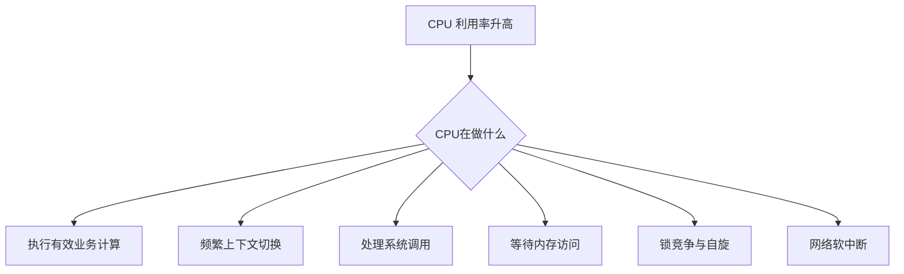
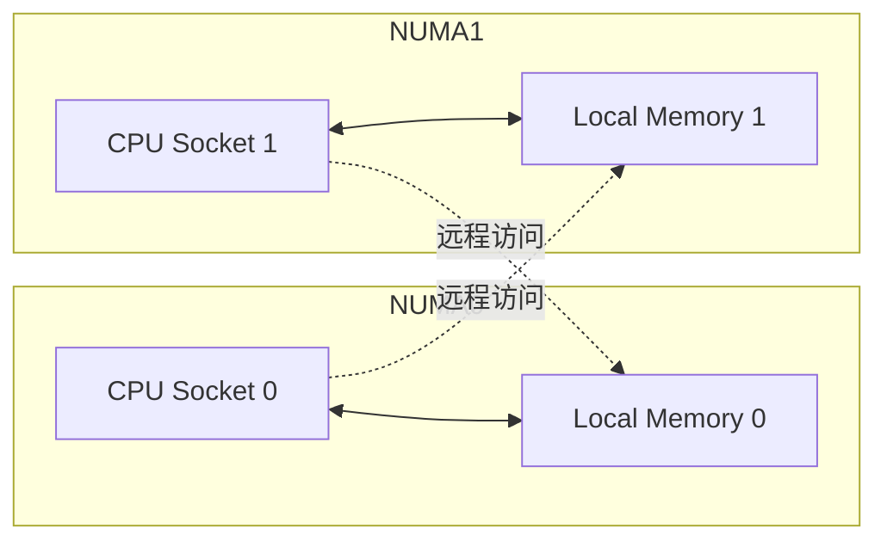
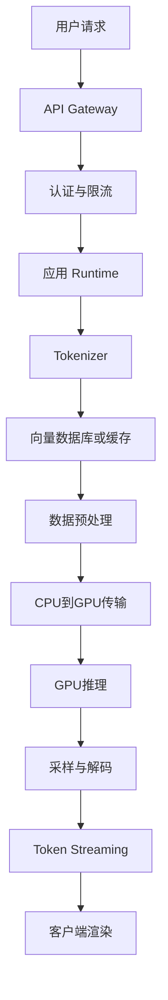
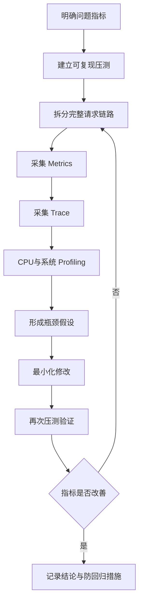
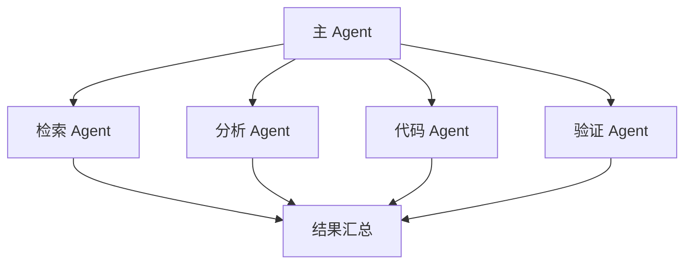

# AI 工程师的真正壁垒：从 Python、eBPF 到 CPU、网络与 GPU

最近在 X 上看到豁如老师的一篇帖子。

帖子讲述了团队里一位 AI 后端 Leader 排查线上性能问题的经历。

让我印象深刻的，并不是他写代码有多快，而是面对任何一个复杂的线上问题，他都能够沿着完整的计算机系统栈持续向下分析：

```
Python
↓
Runtime
↓
Linux
↓
eBPF
↓
CPU 与内存
↓
网络
↓
GPU
```

他不会停留在某个框架、数据库或者模型上，而是不断向下追踪，直到找到真正限制系统性能的瓶颈。

这让我重新意识到一件事：  
**AI 时代，底层能力不仅没有过时，反而变得更加重要。**

很多看起来像是“模型性能问题”的问题，最终可能根本不是模型问题，而是内存、CPU、网络、数据管道或者操作系统问题。

---

## 一、RAG 服务 P99 延迟为什么降不下来

第一个案例是一个 RAG 服务。

系统的 P99 延迟长期居高不下。团队里的所有人都在猜测：
- 是不是大模型响应太慢？
- 是不是向量数据库查询太慢？
- 是不是 Redis 出现了性能瓶颈？
- 是不是 Python GIL 限制了并发？
- 是不是 Embedding 模型推理太慢？

但这位 Leader 只说了一句话：

> **Don't guess. Measure.**  
> 不要猜，先测量。

随后，他开始使用 eBPF 对系统进行观测。

几分钟后，真正的问题暴露了出来。  
不是模型。  
不是向量数据库。  
也不是 Redis。  
而是 Python Runtime 在请求过程中频繁分配和释放大对象，引发了一系列系统级开销：

```
Python 大对象频繁创建
↓
内存映射与释放增多
↓
mmap / munmap 系统调用频繁
↓
Page Fault 增加
↓
锁竞争与 Futex 等待
↓
请求尾延迟升高
```

最终，团队通过调整代码中的对象生命周期、内存复用方式和数据处理流程，将 P99 延迟降低了四十多个百分点。

---

## 二、为什么平均延迟正常，P99 却很高

在性能分析中，平均值经常具有迷惑性。

假设一个接口有 100 个请求：
- 95 个请求耗时 100 毫秒；
- 4 个请求耗时 300 毫秒；
- 1 个请求耗时 5 秒。

平均延迟可能仍然看起来可以接受，但对于那 1% 的用户来说，体验已经非常糟糕。

常见延迟指标包括：

| 指标 | 含义 |
| :--- | :--- |
| **P50** | 50% 的请求在该时间内完成，接近中位数 |
| **P90** | 90% 的请求在该时间内完成 |
| **P95** | 95% 的请求在该时间内完成 |
| **P99** | 99% 的请求在该时间内完成 |
| **Max** | 最慢请求的耗时 |

P99 描述的是系统的尾部延迟。

在 RAG、Agent 和流式推理系统中，尾延迟尤其重要。因为一次完整请求通常需要经过多个环节：


假设每个环节只有 1% 的概率出现慢请求，当多个环节串联之后，整条链路遇到慢节点的概率会不断累积。

这也是为什么一个平均耗时看起来不高的系统，P99 仍然可能非常糟糕。

---

## 三、Python 大对象分配为什么会影响延迟

Python 的开发效率很高，但它的对象模型和内存管理机制会带来额外成本。

一个普通 Python 对象除了保存实际数据，通常还需要额外保存：
- 类型信息；
- 引用计数；
- 对齐空间；
- 对象头；
- 容器内部指针。

例如，在处理 RAG 文档时，如果频繁执行类似操作：

```python
chunks = []
for document in documents:
    chunks.append({
        "content": document.content,
        "metadata": {
            "source": document.source,
            "score": document.score,
        },
        "embedding": list(document.embedding),
    })
```

一次请求中可能创建成千上万个临时对象：
- `dict`
- `list`
- `str`
- `float`
- 元组
- Embedding 数组的复制对象

这些对象虽然单次创建成本不高，但在高并发场景下会产生明显的累计开销。

### 3.1 mmap 与 munmap
`mmap` 用于将一段虚拟地址空间映射到内存或文件。  
`munmap` 用于解除映射。

当运行时频繁申请和释放较大的内存区域时，可能增加：
- 系统调用次数；
- 虚拟内存管理开销；
- 页表更新成本；
- TLB 失效；
- Page Fault；
- 内存碎片。

需要注意的是，并不是每一次 Python 对象分配都会直接调用一次 `mmap`。  
Python 自身存在对象分配器和内存池机制，小对象通常会通过内部内存池处理。但当程序处理大数组、大字符串、大批量序列化结果或者频繁扩缩容的缓冲区时，仍然可能触发底层的大块内存申请和释放。

### 3.2 Page Fault
Page Fault（缺页异常）并不一定意味着程序发生错误。

现代操作系统采用虚拟内存机制。进程访问某个虚拟内存页面时，如果对应的物理页尚未建立映射，就可能触发 Page Fault。

常见类型包括：
- **Minor Page Fault**：数据仍在内存中，只需要建立页表映射；
- **Major Page Fault**：需要从磁盘或者交换空间读取数据。

即使是 Minor Page Fault，也会产生上下文切换、页表更新等开销。当大量请求同时触发 Page Fault 时，延迟抖动就可能变得非常明显。

### 3.3 Futex 等待
Futex 是 Linux 中实现用户态锁和条件变量的重要机制。

Futex 的核心思想是：
- 没有竞争时，在用户态完成加锁和解锁；
- 发生竞争时，再进入内核等待或唤醒。

当性能分析中出现大量 Futex 等待，通常意味着系统存在某种同步竞争，例如：
- 多线程争抢同一把锁；
- Python Runtime 内部锁竞争；
- 内存分配器锁竞争；
- 日志组件锁竞争；
- 连接池锁竞争；
- 队列生产者和消费者速度不匹配。

因此，CPU 利用率高并不一定代表 CPU 正在进行有效计算。它可能在：
- 等锁；
- 处理中断；
- 执行内存管理；
- 发生上下文切换；
- 等待缓存行；
- 等待内存访问。

---

## 四、CPU 利用率高，不等于 CPU 很忙

很多团队排查性能问题时，第一反应是看 Grafana。  
看到 CPU 使用率达到 80%，便认为：**服务器的 CPU 性能不够，需要扩容。**

但 CPU 使用率只是结果，不是原因。  
CPU 时间可能消耗在不同位置：

| 指标 | 含义 |
| :--- | :--- |
| **User Time** | 用户态代码执行 |
| **System Time** | 内核态代码执行 |
| **I/O Wait** | 等待磁盘或其他 I/O |
| **IRQ** | 处理中断 |
| **SoftIRQ** | 处理软中断与网络包 |
| **Steal Time** | 虚拟机 CPU 被宿主机占用 |

即使 CPU 使用率较高，也可能存在以下情况：



因此，真正需要分析的不是“CPU 高不高”，而是：**CPU 时间究竟消耗在了哪里？**

---

## 五、AI 推理服务 CPU 飙高，问题却出在网络栈

第二个案例中，AI 推理服务的 CPU 使用率突然升高。

大家都在查看 Grafana 仪表盘：
- CPU 使用率；
- 内存使用率；
- QPS；
- 接口延迟；
- GPU 利用率。

但这位 Leader 没有继续停留在监控指标上，而是使用了：
- `perf`
- `bcc`
- `bpftool`

沿着应用调用链一路追踪到 Linux Kernel。最终发现，真正的问题是：  
**TCP Receive Queue 出现了大量堆积，应用读取数据的速度跟不上网络接收速度。**

这意味着网络数据已经到达服务器，但应用层没有及时读取。

简化后的数据流如下：


当应用消费速度下降时，数据会堆积在 TCP Receive Queue 中。  
可能的原因包括：
- 应用线程被阻塞；
- 单次读取的数据量太小；
- 请求解析成本过高；
- Event Loop 被长任务占用；
- 工作线程数量不足；
- 内存复制过多；
- CPU 与网卡跨 NUMA 节点访问；
- Socket Buffer 设置不合理。

最终，他们调整了几个关键位置：
- Socket Buffer；
- Batch Read；
- NUMA Affinity。

系统吞吐量立即提升。

---

## 六、Socket Buffer 是什么

Socket Buffer 是 Linux 网络栈中用于暂存网络数据的缓冲区。

常见的两个方向是：
- **Receive Buffer**：接收缓冲区
- **Send Buffer**：发送缓冲区

当接收缓冲区过小时，在高并发或者突发流量下，可能出现：
- 接收队列堆积；
- TCP Window 变小；
- 发送端降速；
- 丢包和重传增加；
- 吞吐量下降。

Linux 中可以通过以下命令观察相关参数：

```bash
sysctl net.core.rmem_default
sysctl net.core.rmem_max
sysctl net.core.wmem_default
sysctl net.core.wmem_max
```

TCP 自动调优参数可以通过以下命令查看：

```bash
sysctl net.ipv4.tcp_rmem
sysctl net.ipv4.tcp_wmem
```

但 Socket Buffer 并不是越大越好。过大的缓冲区也可能造成：
- 单连接内存占用过高；
- 延迟问题被缓冲掩盖；
- Bufferbloat；
- 系统内存压力上升。

正确做法不是照抄某个参数，而是结合：
- 并发连接数；
- 平均消息大小；
- 网络带宽；
- RTT；
- 请求读取速度；
- 内存容量；

进行压测和调整。

---

## 七、为什么 Batch Read 可以提高吞吐

假设应用每次只从 Socket 中读取很少的数据：
- 读取 1 KB
- 处理一次
- 再次调用 `read`
- 再读取 1 KB

这会产生大量：
- 系统调用；
- 用户态与内核态切换；
- Buffer 操作；
- 解析函数调用。

如果改成批量读取：
- 一次读取 64 KB
- 批量解析多条消息
- 批量提交下游处理

可以减少系统调用次数和函数调用开销，提高 CPU 使用效率。

这个思想不仅适用于网络读取，也广泛存在于 AI 系统中：
- 批量查询向量数据库；
- 批量调用 Embedding 模型；
- 批量写入 PostgreSQL；
- 批量发送 Kafka 消息；
- 批量进行 GPU 推理；
- 批量执行 H2D 数据传输。

本质上，Batch 是通过提高单次操作的数据量，摊薄固定成本。

但 Batch 也不是越大越好。Batch 增大通常会带来一个经典权衡：

```
更大的 Batch
↓
吞吐量提高
↓
单请求等待时间增加
↓
实时性和尾延迟可能变差
```

因此，AI 服务往往需要使用**动态批处理（Dynamic Batching）**，而不是固定批处理。  
例如：
- 达到最大 Batch Size 时立即执行；
- 等待超过最大延迟阈值时立即执行；
- 根据当前队列长度动态调整批次。

---

## 八、NUMA Affinity 为什么会影响 AI 服务

NUMA 的全称是 Non-Uniform Memory Access，即非一致性内存访问。

在多路 CPU 服务器中，每个 CPU Socket 通常拥有距离自己更近的本地内存。访问本地内存较快，访问其他 NUMA 节点的远程内存则更慢。



如果网络中断由 NUMA0 上的 CPU 处理，而应用线程运行在 NUMA1，同时数据缓冲区又位于 NUMA0，就可能产生大量跨节点访问。

这会带来：
- 更高的内存访问延迟；
- 更多跨 Socket 通信；
- CPU Cache 一致性开销；
- 更低的吞吐量。

在高性能推理服务中，可能需要协调：
- 网卡所在 NUMA 节点；
- GPU 所在 PCIe 节点；
- 应用线程 CPU 亲和性；
- 内存分配位置；
- 中断处理 CPU。

可以通过以下命令查看 NUMA 拓扑：

```bash
numactl --hardware
lscpu
```

查看 PCIe 设备和 NUMA 节点：

```bash
lspci -vv
cat /sys/class/net/eth0/device/numa_node
```

运行进程时可以设置 CPU 和内存绑定：

```bash
numactl --cpunodebind=0 --membind=0 python server.py
```

这类优化对于普通 CRUD 服务可能并不常见，但在高吞吐 AI 推理、GPU 服务和高速网络场景中，可能产生明显影响。

---

## 九、GPU 利用率只有 55%，问题一定在 GPU 吗

第三个案例更加典型。  
系统中的 GPU 利用率只有 55%。

团队开始研究：
- TensorRT；
- 模型量化；
- CUDA Kernel；
- 算子融合；
- 更换显卡；
- 增大 Batch Size。

但这位 Leader 的判断是：**GPU 没问题，先看 CPU。**

进一步分析后发现，问题出在 Python tokenizer。  
Python tokenizer 在请求处理过程中创建了大量对象，导致：
- CPU 计算压力升高；
- 内存分配增多；
- CPU Cache Miss 较高；
- 数据准备速度不足；
- GPU 长时间等待输入。

完整链路大致如下：


GPU 推理只是整条流水线中的一个阶段。如果前面的 Tokenizer 和数据准备速度不足，GPU 就会处于饥饿状态。

最终，他们进行了以下调整：
- 使用 Rust tokenizer；
- 使用 Pinned Memory；
- 使用异步 H2D Copy；
- 调整 Batch 策略。

模型没有改变。  
显卡没有更换。  
系统吞吐量却接近翻倍。

---

## 十、为什么 Rust Tokenizer 通常更快

Tokenizer 的工作通常包括：
- 文本规范化；
- 字符切分；
- 子词匹配；
- 词表查找；
- Token ID 转换；
- Padding 和 Truncation；
- Attention Mask 构造。

如果这些操作完全在 Python 层执行，会产生大量：
- Python 函数调用；
- 字符串对象；
- List 对象；
- 临时字典；
- 引用计数操作；
- 边界检查。

Rust 实现的 Tokenizer 可以在更底层的连续内存中完成这些操作，并减少 Python 对象创建。

其优势通常包括：
- 更少的运行时开销；
- 更好的并行能力；
- 更低的内存占用；
- 更好的缓存局部性；
- 减少 Python GIL 影响。

这并不意味着所有 Python 代码都应该重写成 Rust。

更合理的方式是：**保留 Python 作为业务编排层，把高频、CPU 密集、对象密集的热点路径下沉到 Rust、C++ 或专用库。**

例如：
- **Python**：API 编排、模型调用、业务逻辑、实验迭代
- **Rust / C++**：Tokenizer、文本解析、高性能序列化、向量计算、网络代理、数据预处理

---

## 十一、CPU Cache Miss 为什么会拖慢 GPU

现代 CPU 的计算速度远高于主内存访问速度。  
为了缓解这个差距，CPU 内部存在多级缓存：

```
寄存器
↓
L1 Cache
↓
L2 Cache
↓
L3 Cache
↓
主内存 RAM
```

不同层级的访问延迟差异很大。  
当程序频繁访问不连续、不可预测的数据时，CPU Cache 命中率会降低。

Python 对象通常通过指针关联：

```
[List] -> Pointer -> Python Object
       -> Pointer -> Python Object
       -> Pointer -> Python Object
       -> Pointer -> Python Object
```

这些对象可能分散在不同内存位置。CPU 在遍历时需要不断进行指针跳转，容易导致：
- Cache Miss；
- 内存访问等待；
- 分支预测失败；
- CPU Pipeline 停顿。

与之相比，连续数组通常具有更好的局部性：

```
[1, 2, 3, 4, 5, 6, 7, 8]
```

这也是 NumPy、PyTorch、Arrow、Rust Vec 和 C++ Vector 等连续内存结构性能较好的重要原因。

当 CPU Cache Miss 无法及时完成 Tokenizer 或数据预处理时，GPU 就无法获得足够的数据。  
因此，GPU 利用率低可能不是 GPU 计算能力不足，而是数据供应不足。

---

## 十二、Pinned Memory 与异步 H2D Copy

H2D 是 Host to Device 的缩写，表示数据从主机内存复制到 GPU 显存。

普通主机内存通常是 Pageable Memory，也就是可分页内存。  
GPU DMA 不能始终直接从任意可分页内存高效传输数据。在数据复制过程中，运行时可能需要先将数据复制到固定内存区域，再传输到 GPU。

**Pinned Memory**，也叫 Page-Locked Memory，是不会被操作系统换出的固定内存。  
它通常能够提供更高效的 CPU 到 GPU 数据传输。

PyTorch 中可以使用：

```python
data_loader = DataLoader(
    dataset,
    batch_size=32,
    pin_memory=True,
)
```

随后可以使用异步方式将 Tensor 复制到 GPU：

```python
inputs = inputs.to(
    device="cuda",
    non_blocking=True,
)
```

理想情况下，可以让数据传输与 GPU 计算重叠：

```mermaid
gantt
    title 同步与异步数据传输对比
    dateFormat X
    axisFormat %L
    section 同步模式
    H2D Copy 1 : 0, 20
    GPU Compute 1 : 20, 60
    H2D Copy 2 : 60, 80
    GPU Compute 2 : 80, 120
    section 流水线模式
    H2D Copy 1 : 0, 20
    GPU Compute 1 : 20, 60
    H2D Copy 2 : 20, 40
    GPU Compute 2 : 60, 100
```



不过，Pinned Memory 同样不能无限使用。  
因为它无法被操作系统正常换出，过量使用可能影响系统整体内存管理。

---

## 十三、很多 AI 性能问题，最后都不是 AI 问题

这三个案例共同说明了一件事：  
**很多 AI 性能问题，最终根本不是 AI 问题，而是系统问题。**

一个完整的 AI 服务包含的不只是模型：



任何一个环节都可能成为瓶颈。例如：

| 表面现象 | 潜在真实原因 |
| :--- | :--- |
| **LLM 响应很慢** | Prompt 太长、排队、Batch 策略不合理 |
| **GPU 利用率低** | Tokenizer 慢、H2D Copy 慢、Batch 太小 |
| **CPU 利用率高** | 网络软中断、锁竞争、对象分配、序列化 |
| **P99 延迟高** | Page Fault、GC、连接池等待、队列堆积 |
| **Token Streaming 卡顿** | Proxy Buffer、TCP 拥塞、Event Loop 阻塞 |
| **Agent 越多越慢** | 串行调用、上下文膨胀、工具排队、状态复制 |
| **RAG 查询慢** | Embedding、网络、重排、数据结构、索引配置 |
| **吞吐无法提升** | CPU、内存带宽、NUMA、网络或数据管道饥饿 |

因此，AI 性能优化不能只盯着模型参数和推理框架。

---

## 十四、为什么 eBPF 能快速发现系统瓶颈

eBPF 可以在 Linux Kernel 中安全地运行受限制的程序，用于观测系统事件。

它可以帮助我们追踪：
- 系统调用；
- 网络事件；
- CPU 调度；
- 文件系统操作；
- 内存分配；
- Page Fault；
- TCP 重传；
- 锁竞争；
- 函数调用栈；
- 用户态与内核态函数。

传统监控通常只能告诉我们：
```
CPU 使用率为 85%
P99 延迟为 1.2 秒
内存使用率为 70%
```

而 eBPF 更接近回答：
```
CPU 时间具体消耗在哪些函数？
哪个进程产生了最多的 mmap？
请求在哪个内核路径上等待？
哪个 TCP 连接发生了重传？
哪些线程正在等待 Futex？
哪些调用触发了 Page Fault？
```

可以将三类工具理解为不同层次：
- **Grafana / Prometheus** -> 回答：系统发生了什么？
- **Tracing / Profiling** -> 回答：问题发生在哪个调用链？
- **eBPF / perf** -> 回答：CPU 和内核到底在执行什么？

### 常见工具
#### perf
用于 Linux 性能分析，可以观察：CPU Cycle、Instructions、Cache Miss、Context Switch、函数热点、调用栈。

```bash
sudo perf stat -p <PID>
sudo perf record -F 99 -p <PID> -g -- sleep 30
sudo perf report
```

#### BCC
BCC 提供了大量基于 eBPF 的现成工具，例如：`execsnoop`、`opensnoop`、`tcpconnect`、`tcpretrans`、`runqlat`、`offcputime`、`profile`、`biolatency`。

例如观察 TCP 重传：
```bash
sudo tcpretrans
```
观察进程的 Off-CPU 时间：
```bash
sudo offcputime -p <PID> 30
```

#### bpftool
bpftool 是 Linux 官方提供的 eBPF 管理工具，可用于查看：已加载的 BPF 程序、BPF Map、BTF 信息、网络接口上的 BPF 程序。

```bash
sudo bpftool prog list
sudo bpftool map list
```

---

## 十五、一次正确的 AI 性能排查应该怎么做

面对线上性能问题，最危险的做法是直接凭经验修改参数。  
例如：
- 看到 CPU 高就扩容；
- 看到 GPU 低就增大 Batch；
- 看到接口慢就加 Redis；
- 看到 Python 慢就改 Rust；
- 看到数据库慢就加索引；
- 看到 P99 高就增加机器。

这些措施可能有效，但也可能只是偶然掩盖问题。更合理的流程是：



### 第一步：明确问题
不要只说“服务很慢”。需要明确：
- 哪个接口？
- 什么时间开始？
- P50、P95、P99 分别是多少？
- 吞吐量是多少？
- 是否与并发量相关？
- 是否只发生在某些请求？
- 是否只发生在某些机器？
- 是否与输入长度相关？

### 第二步：建立可复现压测
如果问题无法稳定复现，就很难验证优化是否有效。需要固定：
- 请求数据；
- 并发数；
- 输入长度；
- 模型版本；
- Batch 参数；
- 机器规格；
- 数据库数据量；
- 网络环境。

### 第三步：拆分链路耗时
对 AI 请求链路进行分段计时：
```
request_parse_ms -> auth_ms -> embedding_ms -> vector_search_ms -> rerank_ms -> prompt_build_ms -> queue_wait_ms -> tokenizer_ms -> h2d_copy_ms -> prefill_ms -> decode_ms -> stream_flush_ms
```
只有拆分之后，才能判断时间究竟消耗在哪里。

### 第四步：从指标进入系统内部
可以按照以下层次逐步深入：
```
业务指标 -> 应用指标 -> 分布式 Trace -> Runtime Profiling -> 系统调用 -> Linux Kernel -> CPU / 内存 / 网络 / GPU
```

### 第五步：一次只验证一个主要假设
例如：假设 P99 延迟来自频繁大对象分配。  
可以通过以下方式验证：
- 采集内存分配热点；
- 对比 mmap / munmap 次数；
- 观察 Page Fault；
- 改为 Buffer 复用；
- 使用相同压测重新测试；
- 对比修改前后的 P99 和吞吐。

避免一次修改十几个参数，否则即使性能提升，也无法知道真正有效的是哪项修改。

---

## 十六、Agent 为什么越多越慢

原帖中有一个非常值得延伸的问题：**为什么 Agent 越多，系统反而越慢？**

多 Agent 系统并不会天然提高性能。假设一个任务被拆分给多个 Agent：



从架构图上看，似乎可以并行。但实际系统还会产生大量额外成本：
- 每个 Agent 都需要构建 Prompt；
- 每个 Agent 都可能复制上下文；
- 每个 Agent 都会产生模型排队；
- Agent 之间需要序列化和传输状态；
- 工具调用存在网络延迟；
- 汇总 Agent 需要再次读取所有结果；
- Token 数量会快速膨胀；
- 并行任务可能争抢同一个模型服务；
- 共享数据库和工具可能成为瓶颈。

假设一个单 Agent 请求消耗 10,000 Tokens。拆分成 5 个 Agent 后，并不一定是每个 Agent 只消耗 2,000 Tokens。实际情况可能是：
- 主 Agent 上下文：10,000
- 检索 Agent：6,000
- 分析 Agent：8,000
- 代码 Agent：9,000
- 验证 Agent：7,000
- 最终汇总：12,000
- **总计：52,000 Tokens**

因此，多 Agent 架构应该建立在任务确实可以并行、上下文可以隔离、结果可以低成本合并的前提下。否则，它可能只是把一个简单问题变成了一个昂贵的分布式系统问题。

---

## 十七、Token Streaming 为什么会卡

很多大模型接口的首 Token 很快，但流式输出过程中会出现停顿。这类问题可能来自多个层次：
- 模型解码速度；
- 代理服务器缓冲；
- HTTP Chunk Flush；
- Event Loop 阻塞；
- TCP 拥塞与重传；
- 客户端渲染；
- 日志同步写入；
- 内容审核；
- 下游工具调用。

例如，Nginx 或其他反向代理可能对响应进行缓冲。应用虽然已经生成了 Token，但代理层没有立即向客户端 Flush，用户看到的效果就会是：停顿两秒 -> 一次出现大量文字 -> 再次停顿。

Node.js 或 Bun 服务中，如果 Event Loop 被 CPU 密集任务阻塞，也会影响流式数据发送。例如：

```javascript
for (const token of tokens) {
    response.write(token);
    // 同步 CPU 密集任务阻塞 Event Loop
    expensiveSynchronousTask();
}
```

更合理的方式是将 CPU 密集任务：
- 下沉到 Worker Thread；
- 交给独立进程；
- 使用 Rust / C++ 扩展；
- 拆分成异步批次；
- 在流式链路之外执行。

因此，Token Streaming 卡顿不能只通过“模型生成速度”解释。

---

## 十八、后端不是写 CRUD，而是在理解计算机

后来有人问这位 AI 后端 Leader：为什么你懂这么多？

他的回答是：**后端不是写 CRUD，而是在理解计算机。**

这句话非常值得反复思考。  
CRUD 当然重要。绝大多数业务系统都离不开：创建数据、查询数据、更新数据、删除数据、权限控制、业务流程、数据校验。

但 CRUD 只是后端工程的一种表现形式。真正的后端工程能力，还包括理解：
- 代码如何被 Runtime 执行；
- Runtime 如何申请内存；
- 线程如何被操作系统调度；
- 数据如何进入 CPU Cache；
- 网络包如何穿过内核协议栈；
- 文件如何进入 Page Cache；
- 数据如何从 CPU 传输到 GPU；
- 多进程如何进行通信；
- 高并发下资源如何竞争；
- 系统为什么在某些边界条件下失效。

框架帮助我们屏蔽了大量复杂度。  
**但当系统出现异常时，那些被屏蔽的复杂度会重新出现。**

---

## 十九、AI 越强，为什么计算机基础越重要

AI 可以帮助我们：生成代码、补全代码、重构代码、解释报错、编写单元测试、生成 SQL、搭建项目结构、调用现有框架。

但 AI 并不会自动替我们完成所有系统判断。面对以下问题，仍然需要工程师理解底层系统：
- 为什么 GPU 一直在等待 CPU？
- 为什么 Token Streaming 会间歇性卡顿？
- 为什么 Agent 数量增加后，系统延迟急剧升高？
- 为什么 CPU 使用率很高，但吞吐没有提升？
- 为什么 P99 延迟突然升高？
- 为什么同样的程序换一台机器就变慢？
- 为什么容器中的性能与宿主机不同？
- 为什么增加线程后性能反而下降？
- 为什么网络带宽没有跑满？
- 为什么数据库查询只在高并发下变慢？

AI 可以给出许多可能原因。但工程师必须知道：
1. 应该测量什么；
2. 使用什么工具测量；
3. 如何判断数据是否可信；
4. 如何从现象缩小到根因；
5. 如何设计对照实验；
6. 如何确认优化没有引入新的问题。

这正是系统能力的价值。

---

## 二十、AI 工程师应该补哪些计算机基础

对于 AI 应用开发工程师，可以按照以下路线补充系统能力。

### 第一阶段：Linux 基础
- **重点掌握**：进程与线程、文件描述符、信号、管道、Socket、虚拟内存、Page Cache、系统调用、权限与 Namespace、cgroups。
- **常用命令**：`top`、`htop`、`ps`、`pidstat`、`vmstat`、`iostat`、`sar`、`ss`、`lsof`、`strace`、`dmesg`。

### 第二阶段：CPU 与内存
- **重点掌握**：CPU Cache、Cache Line、分支预测、上下文切换、False Sharing、NUMA、Page Fault、TLB、内存带宽、内存分配器。
- **常用工具**：`perf`、`numactl`、`pmap`、`smem`、`valgrind`。

### 第三阶段：Linux 网络
- **重点掌握**：TCP 三次握手与四次挥手、Receive Queue 与 Send Queue、Socket Buffer、TCP Window、拥塞控制、重传、Keepalive、epoll、网络软中断、Connection Pool。
- **常用工具**：`ss`、`tcpdump`、`ethtool`、`ip`、`nstat`、`sar -n DEV`。

### 第四阶段：Profiling 与 eBPF
- **重点掌握**：On-CPU Profiling、Off-CPU Profiling、Flame Graph、系统调用追踪、调度延迟、网络追踪、内存分配追踪。
- **常用工具**：`perf`、`bcc`、`bpftrace`、`bpftool`。

### 第五阶段：GPU 与推理流水线
- **重点掌握**：CUDA 基础、显存与主存、H2D 与 D2H、Pinned Memory、CUDA Stream、Kernel Launch、Batch、Prefill 与 Decode、KV Cache、Tensor Parallel、Pipeline Parallel。
- **常用工具**：`nvidia-smi`、`nsys`、`ncu`、`torch.profiler`。

---

## 二十一、结合我的 AI 应用开发经历的一些思考

我过去做过数据分析、数据平台、自动化和 AI 应用开发。目前也在持续实践：
- RAG；
- PGVector；
- Embedding；
- HDBSCAN 聚类；
- LLM 文本分类；
- MCP；
- Agent；
- Bun、TypeScript 与 Python；
- PostgreSQL 数据同步；
- AI 数据分析平台。

过去我会更关注：
- 框架是否流行；
- Agent 应该使用 LangChain 还是自己实现；
- MCP Server 应该用 Python 还是 TypeScript；
- 向量数据库应该选择哪个；
- 模型应该选择 DeepSeek 还是 OpenAI；
- 是否需要接入 LangSmith。

这些问题当然重要。但看完这篇内容，我越来越意识到，**真正能够拉开工程差距的可能不是“会不会调用某个框架”，而是能不能解释整个系统为什么这样运行。**

例如，在一个 VOC 评论分析系统中，表面上看只是：
```
PostgreSQL + Embedding + PGVector + LLM 分类 + React Dashboard
```

但系统真正上线后，还会面对：
- 8,000 条数据可以运行，80 万条是否还能运行？
- Embedding 是单条执行还是批量执行？
- Python 进程为什么越来越占内存？
- 批量写入 PostgreSQL 的最佳大小是多少？
- HDBSCAN 为什么突然消耗大量内存？
- Bun 与 Python 之间如何高效通信？
- Agent 并发调用数据库时如何控制连接数？
- 流式报告生成为什么会卡顿？
- P95 和 P99 为什么随着并发上升急剧恶化？
- 向量检索慢，到底是索引、磁盘、内存还是 SQL 问题？

这些问题都不会因为使用了 AI 框架而自动消失。  
相反，Agent、RAG 和大模型让系统链路变得更长，涉及的组件更多，性能问题也会更加复杂。

---

## 二十二、我的总结：不要过早优化，但必须具备向下追踪的能力

读完原帖后，我并不认为所有 AI 开发者都应该立即学习如何编写复杂的 eBPF 程序，也不认为每个项目都需要进行 NUMA 绑定和内核调优。

过早优化仍然可能浪费大量时间。对于一个刚上线的 MVP，最重要的可能仍然是：
- 快速验证需求；
- 保证基本正确性；
- 建立最小监控；
- 收集真实用户反馈；
- 避免明显的架构错误。

但工程师必须具备一种能力：**当系统出现问题时，能够从业务层不断向下追踪，而不是停留在猜测和经验判断上。**

一个成熟的排查路径应该是：
```
先确认现象 -> 再建立指标 -> 然后复现问题 -> 接着拆分链路 -> 再进入 Runtime -> 最后进入操作系统和硬件
```

不要一看到 AI 服务慢，就认为模型需要升级。  
不要一看到 GPU 利用率低，就认为显卡性能不足。  
不要一看到 CPU 使用率高，就立即增加机器。  
不要一看到数据库慢，就盲目添加索引。

**真正专业的性能优化，首先是测量，其次才是修改。**

---

## 二十三、结语

原帖中最打动我的一句话是：
> **后端不是写 CRUD，而是在理解计算机。**

过去，我们学习 Linux、操作系统、计算机组成和计算机网络时，可能会觉得这些知识距离业务开发太远。但随着 AI 应用进入生产环境，这些基础知识正在重新变得重要。

模型会变化。  
框架会变化。  
Agent 架构会变化。  
向量数据库会变化。  

今天流行的技术栈，几年之后可能就会被替代。但是：
- CPU 仍然需要执行指令；
- 内存仍然存在访问延迟；
- 网络仍然会发生拥塞和重传；
- 线程仍然需要被操作系统调度；
- GPU 仍然需要等待数据；
- 分布式系统仍然需要处理一致性和故障；
- 性能问题仍然需要通过测量找到根因。

未来的 AI 工程师，拼的不只是模型调用能力，也不只是 Prompt、RAG 和 Agent。  
**真正决定工程上限的，往往是对整个计算机系统的理解。**

框架会变，模型会变，Agent 会变。  
但真正理解计算机的人，会越来越稀缺。

---

### 原帖核心观点摘录

以下内容根据豁如老师在 X 发布的帖子整理：

> 我们组新来的 AI 后端 Leader，他真的太恐怖了。  
> 不是因为代码写得快。  
> 而是任何一个线上问题，他都能一路从 Python、Linux、eBPF、CPU、网络追踪到 GPU，把真正的瓶颈找出来。  
> 
> 这让我意识到：AI 时代，底层能力反而更值钱了。  
> 很多 AI 性能问题，最后根本不是 AI 问题，而是系统问题。  
> 
> **后端不是写 CRUD，而是在理解计算机。**  
> AI 越强，Linux、操作系统、计算机组成和计算机网络这些知识就越重要。  
> 因为真正决定系统上限的，往往不是模型，而是整个计算机系统。  
> 
> 未来的 AI 工程师，拼的不只是模型能力，而是计算机系统能力。  
> 框架会变，模型会变，Agent 会变。  
> 但真正理解计算机的人，会越来越稀缺。

---

### 参考学习资料

#### 书籍
- 《深入理解计算机系统》（CSAPP）
- 《性能之巅：洞悉系统、企业与云计算》
- 《Linux 性能优化实战》
- 《Linux 内核设计与实现》
- 《计算机网络：自顶向下方法》
- 《操作系统导论》
- *Systems Performance*
- *BPF Performance Tools*

#### 建议实践项目
1. 为 FastAPI、Fastify 或 Bun 服务添加 P50、P95、P99 指标；
2. 使用 `perf` 生成一次 CPU Flame Graph（火焰图）；
3. 使用 `strace` 分析 Python 服务的系统调用；
4. 使用 BCC 观察 TCP 重传和调度延迟；
5. 对比 Python Tokenizer 与 Rust Tokenizer 的性能；
6. 测试不同 Batch Size 对吞吐和 P99 的影响；
7. 对比普通内存与 Pinned Memory 的 H2D 传输；
8. 为 RAG 链路增加分阶段耗时监控；
9. 分析一次 Agent 请求的 Token、网络和工具调用开销；
10. 记录一次从 Grafana 指标追踪到代码根因的完整过程。

---
*原始内容作者：豁如 (X账号: @huoru_tarnish)*  
*本文在原帖观点基础上进行了结构化整理，并补充了相关系统原理、技术解释和个人理解。*

---

## 个人评论与工程衍生思考

读完这篇整理，最大的共鸣莫过于对**“复杂系统的去魅与追踪能力”**的强调。作为同样在 AI 应用开发前端、后端与数据分析链路里踩过坑的开发者，我想在文末补充几点从工程实际出发的读后感想：

### 1. 语言与运行时生态的选择：为什么我对 Bun 与 TypeScript 寄予厚望
文中多次提及 Python 在处理数据和文本时由于 GIL（全局解释器锁）以及频繁的临时对象创建、`mmap/munmap`、Page Fault 所带来的尾延迟（P99）恶化问题。在实际的 AI 业务编排中，尤其是 MCP (Model Context Protocol) Server 的实现以及 Agent 的并发调度上，我个人现在非常倾向于**使用 Bun + TypeScript 作为业务编排层**。
- Node/Bun 异步事件驱动的底座，对处理 LLM 大量的 I/O 密集型流式请求（Token Streaming）比传统的 Python 多进程/同步模型要天然顺畅得多；
- 避免了 Python 在高并发编排下复杂的锁竞争与内存碎片问题，只有当确实进入数据预处理、Embedding 计算或重度科学计算（如 PGVector 结合、HDBSCAN 聚类）时，再通过高效的通信机制交由底层 Python 或 Rust/C++ 模块处理。这种**“轻编排 + 重底层”**的异构解耦，是极具性价比的架构实践。

### 2. RAG 与向量检索的现实泥潭：数据库不是银弹
在做基于 PostgreSQL + PGVector 的 RAG 和 AI 数据分析平台时，非常容易陷入一个误区：“加了 HNSW 索引、换了 PGVector 就能够按秒级召回”。但一旦数据规模从几千条飙升到几十万、百万条时（就像文中提到的 VOC 评论分析），真正卡住吞吐的往往是：
- **连接池排队与 Futex 等待**：并发 Agent 同时发起多路向量检索，导致连接池瞬间耗尽；
- **内存与 Cache 一致性**：大量高维浮点数组在内存中的不连续加载，导致 CPU L2/L3 Cache Miss 飙升；
- **I/O Wait**：未命中 Page Cache 时，高频的大块随机读取让磁盘 I/O 成为噩梦。
这也再次印证了文中那句铁律——**别猜，先量（Don't guess. Measure.）**。用 `perf` 和数据库原生指标去量化瓶颈，远比盲目切换向量数据库引擎更解决问题。

### 3. 系统底层能力决定了我们在“AI 工业化时代”的技术安全感
现在的 AI 框架发展太快了，从早期的 LangChain、LlamaIndex，到如今复杂的 Agent 编排协议与 MCP 架构，层层抽象将底层的操作系统、网络协议栈、内存分配与硬件通信全数掩盖。
然而，抽象仅仅是“隐藏”了复杂度，从未“消除”复杂度。当遇到系统瓶颈、偶发性卡顿、吞吐遇到天花板时，那些只会调 API 与堆砌框架的开发者将面临真正的“黑盒恐惧”。只有深入理解计算机的底层运行逻辑（如 Socket Buffer、NUMA 亲和性、eBPF 追踪、Pinned Memory），才能在遇到复杂长链路故障时如庖丁解牛般切中要害。

**“下山的老虎也是老虎。”** 传统后端工程的底气与对操作系统、系统栈的扎实理解，不是在 AI 时代被淘汰的旧产物，相反，它们是我们驾驭 AI 时代这些庞大、复杂、高吞吐分布式系统时，最锋利也最无可替代的手术刀。