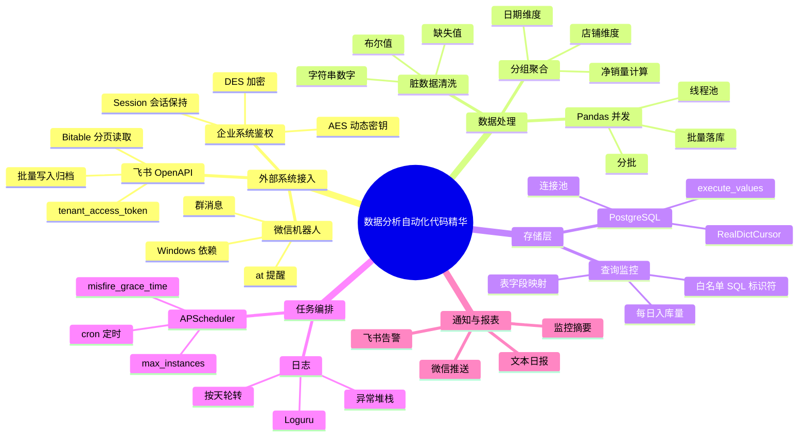

这份文档把零散的业务代码片段重新整理为一套可复用的数据自动化工程模板。核心目标不是“收藏代码”，而是沉淀稳定的模块边界：外部系统接入、数据采集、数据清洗、数据库写入、调度编排、监控告警和报表渲染。

适用场景：

- 飞书多维表格数据同步、归档与告警。
- 企业内部系统登录、爬取、下载与解析。
- PostgreSQL 批量写入、统计查询与入库监控。
- 每日/每小时自动化报表推送到微信或飞书。
- 数据分析脚本从“一次性跑通”升级为“可维护任务”。

## 0. 总体思维导图



## 1. 推荐工程结构

当自动化任务开始变复杂时，建议把代码拆成清晰模块，避免所有逻辑塞进一个脚本。

```text
data_automation/
  app/
    clients/
      feishu.py
      wechat.py
      enterprise_auth.py
    pipelines/
      bitable_archive.py
      db_monitor.py
      sales_report.py
    storage/
      postgres.py
    utils/
      cleaning.py
      logging.py
      scheduler.py
  tests/
  .env
  pyproject.toml
  README.md
```

模块职责：

| 模块         | 职责                                             |
| ------------ | ------------------------------------------------ |
| `clients/`   | 封装外部 API、机器人、登录鉴权等边界能力         |
| `storage/`   | 封装数据库连接池、批量写入、查询方法             |
| `pipelines/` | 编排一个完整业务流程，例如采集、清洗、入库、推送 |
| `utils/`     | 日志、配置、清洗、时间处理等通用工具             |
| `tests/`     | 覆盖清洗函数、参数构造、聚合逻辑等纯函数         |

## 2. 基础设施：日志、配置与调度

### 2.1 日志配置

日志是自动化任务的生命线。所有无人值守任务都应该有文件日志、保留周期和异常堆栈。

```python
from pathlib import Path
from loguru import logger


def setup_logger(log_dir: str = "./Log", name: str = "data-job") -> None:
    Path(log_dir).mkdir(parents=True, exist_ok=True)
    logger.add(
        f"{log_dir}/{name}-{{time:YYYY-MM-DD}}.log",
        rotation="00:00",
        retention=7,
        level="INFO",
        encoding="utf-8",
    )
```

要点：

- 控制台输出适合本地调试，文件日志适合生产排障。
- 定时任务必须记录开始、结束、耗时、核心数量、失败原因。
- 捕获全局异常时保留 `traceback`，否则第二天很难定位问题。

### 2.2 配置读取

密钥、数据库密码、飞书 app secret 不要硬编码在脚本里。

```python
import os
from dataclasses import dataclass


@dataclass(frozen=True)
class AppConfig:
    feishu_app_id: str
    feishu_app_secret: str
    feishu_chat_id: str
    pg_host: str
    pg_port: int
    pg_user: str
    pg_password: str
    pg_dbname: str


def load_config() -> AppConfig:
    return AppConfig(
        feishu_app_id=os.environ["FEISHU_APP_ID"],
        feishu_app_secret=os.environ["FEISHU_APP_SECRET"],
        feishu_chat_id=os.environ["FEISHU_CHAT_ID"],
        pg_host=os.environ["PG_HOST"],
        pg_port=int(os.environ.get("PG_PORT", "5432")),
        pg_user=os.environ["PG_USER"],
        pg_password=os.environ["PG_PASSWORD"],
        pg_dbname=os.environ["PG_DBNAME"],
    )
```

### 2.3 轻量级定时任务调度

`APScheduler` 适合单机脚本型自动化任务。它比手写 `while True + sleep` 更可控。

```python
import traceback
from apscheduler.schedulers.blocking import BlockingScheduler
from loguru import logger


def run_daily_report() -> None:
    try:
        logger.info("开始执行每日数据拉取与推送任务")
        # 1. 拉取外部数据
        # 2. 清洗、聚合、入库
        # 3. 生成报表并推送
        logger.info("每日任务执行完成")
    except Exception:
        logger.error(f"每日任务执行失败:\n{traceback.format_exc()}")


def start_scheduler() -> None:
    scheduler = BlockingScheduler(timezone="Asia/Shanghai")
    scheduler.add_job(
        run_daily_report,
        "cron",
        hour=9,
        minute=20,
        misfire_grace_time=180,
        coalesce=True,
        max_instances=1,
    )

    logger.info("数据自动化定时任务已启动")
    try:
        scheduler.start()
    except (KeyboardInterrupt, SystemExit):
        logger.info("定时任务已安全退出")
```

关键参数：

- `misfire_grace_time`：错过触发时间后的宽限秒数。
- `coalesce=True`：积压多次任务时合并为一次执行。
- `max_instances=1`：避免上一次还没跑完，下一次又启动。

## 3. 外部系统接入层

### 3.1 飞书 OpenAPI：鉴权与多维表格读取

这部分的核心是两件事：获取 `tenant_access_token`，以及分页读取 Bitable 记录。

```python
from typing import Any
import requests
from loguru import logger


class FeishuBitableClient:
    def __init__(self, app_id: str, app_secret: str, timeout: int = 15):
        self.app_id = app_id
        self.app_secret = app_secret
        self.timeout = timeout
        self.session = requests.Session()
        self.tenant_token = self._get_tenant_token()
        self.session.headers.update({
            "Authorization": f"Bearer {self.tenant_token}",
            "Content-Type": "application/json",
        })

    def _get_tenant_token(self) -> str:
        url = "https://open.feishu.cn/open-apis/auth/v3/tenant_access_token/internal"
        payload = {"app_id": self.app_id, "app_secret": self.app_secret}
        resp = requests.post(url, json=payload, timeout=self.timeout)
        resp.raise_for_status()

        data = resp.json()
        if data.get("code") != 0:
            raise RuntimeError(f"获取飞书 tenant_access_token 失败: {data}")
        return data["tenant_access_token"]

    def fetch_records(self, app_token: str, table_id: str, page_size: int = 100) -> list[dict[str, Any]]:
        url = f"https://open.feishu.cn/open-apis/bitable/v1/apps/{app_token}/tables/{table_id}/records"
        records: list[dict[str, Any]] = []
        page_token: str | None = None

        while True:
            params = {"page_size": page_size}
            if page_token:
                params["page_token"] = page_token

            resp = self.session.get(url, params=params, timeout=self.timeout)
            resp.raise_for_status()
            data = resp.json()
            if data.get("code") != 0:
                raise RuntimeError(f"读取飞书表格失败: {data}")

            payload = data.get("data", {})
            records.extend(item.get("fields", {}) for item in payload.get("items", []))

            if not payload.get("has_more"):
                break
            page_token = payload.get("page_token")

        logger.info(f"读取飞书表格完成，table_id={table_id}, records={len(records)}")
        return records
```

改进点：

- 增加 `timeout`，避免请求永久阻塞。
- 使用 `raise_for_status()` 处理 HTTP 层错误。
- 检查飞书业务状态码 `code`。
- 支持 `page_token`，避免只能读取第一页。

### 3.2 飞书告警通道

告警发送应该保持简单，业务方只传入文本即可。

```python
import json
import requests
from loguru import logger


class FeishuAlerter:
    def __init__(self, app_id: str, app_secret: str, receive_id: str, timeout: int = 15):
        self.receive_id = receive_id
        self.timeout = timeout
        self.client = FeishuBitableClient(app_id, app_secret, timeout=timeout)

    def send_text(self, content: str) -> None:
        url = "https://open.feishu.cn/open-apis/im/v1/messages"
        params = {"receive_id_type": "chat_id"}
        payload = {
            "receive_id": self.receive_id,
            "msg_type": "text",
            "content": json.dumps({"text": content}, ensure_ascii=False),
        }

        resp = self.client.session.post(url, params=params, json=payload, timeout=self.timeout)
        resp.raise_for_status()
        data = resp.json()
        if data.get("code") != 0:
            raise RuntimeError(f"飞书消息发送失败: {data}")

        logger.info("飞书告警发送成功")
```

### 3.3 微信机器人群消息封装

基于 WeChatFerry 的微信机器人适合 Windows 本地自动化场景。它强依赖 Windows 环境和特定版本 PC 微信，无法在 macOS 原生运行。

```python
from loguru import logger
from wcferry import Wcf


class WechatRobot:
    def __init__(self, debug: bool = True):
        self.wcf = Wcf(debug=debug)

    def send_group_text(self, msg: str, room_id: str) -> int:
        logger.info(f"发送微信群消息，room_id={room_id}")
        return self.wcf.send_text(msg, room_id)

    def send_at_msg(self, msg: str, room_id: str, at_users: dict[str, str]) -> int | None:
        if not at_users:
            logger.info("无需要提醒的人员")
            return None

        at_text = " ".join(f"@{name}" for name in at_users)
        receivers = ",".join(at_users.values())
        final_msg = f"{at_text}\n{msg}"

        logger.info(f"发送微信群 at 消息，room_id={room_id}, receivers={receivers}")
        return self.wcf.send_text(final_msg, room_id, receivers)
```

### 3.4 企业系统登录：Session 与加密鉴权

很多内部系统会复用前端加密逻辑。爬虫类代码的关键不是“绕过”，而是稳定复现浏览器请求：请求头、会话、密钥获取、密码加密、Token 保存。

#### DES 示例

```python
import binascii
import requests
from Crypto.Cipher import DES
from Crypto.Util.Padding import pad


class EnterpriseSpider:
    def __init__(self, username: str, password: str):
        self.username = username
        self.password = password
        self.session = requests.Session()
        self.session.headers.update({
            "User-Agent": "Mozilla/5.0 (Windows NT 10.0; Win64; x64) AppleWebKit/537.36",
        })

    @staticmethod
    def encrypt_des(text: str, key: str = "1q2was#4", iv: str = "1q2was#4") -> str:
        key_bytes = key.encode("utf-8")
        iv_bytes = iv.encode("utf-8")
        cipher = DES.new(key_bytes, DES.MODE_CBC, iv_bytes)
        encrypted = cipher.encrypt(pad(text.encode("utf-8"), DES.block_size))
        return binascii.hexlify(encrypted).decode("utf-8")
```

#### AES 动态密钥示例

```python
import base64
import uuid
import requests
from Crypto.Cipher import AES
from Crypto.Util.Padding import pad
from loguru import logger


class LingXingAuth:
    def __init__(self, account: str, password: str, timeout: int = 15):
        self.account = account
        self.password = password
        self.timeout = timeout
        self.session = requests.Session()
        self.session.headers.update({
            "origin": "https://erp.lingxing.com",
            "referer": "https://erp.lingxing.com/",
            "user-agent": "Mozilla/5.0 (Windows NT 10.0; Win64; x64) AppleWebKit/537.36",
            "x-ak-request-source": "erp",
        })

    @staticmethod
    def _encrypt_password(key: str, password: str) -> str:
        cipher = AES.new(key.encode("utf-8"), AES.MODE_ECB)
        encrypted = cipher.encrypt(pad(password.encode("utf-8"), AES.block_size))
        return base64.b64encode(encrypted).decode("utf-8")

    def login(self) -> tuple[str | None, str | None]:
        secret_url = "https://gw.lingxingerp.com/newadmin/api/passport/getLoginSecretKey"
        secret_resp = self.session.post(secret_url, timeout=self.timeout)
        secret_resp.raise_for_status()
        secret_data = secret_resp.json()["data"]

        payload = {
            "account": self.account,
            "pwd": self._encrypt_password(secret_data["secretKey"], self.password),
            "uuid": str(uuid.uuid4()),
            "auto_login": 1,
            "secretId": secret_data["secretId"],
        }

        login_url = "https://gw.lingxingerp.com/newadmin/api/passport/login"
        resp = self.session.post(login_url, json=payload, timeout=self.timeout)
        resp.raise_for_status()
        data = resp.json()

        logger.info("企业系统登录请求完成")
        return data.get("token"), data.get("companyId")
```

安全提醒：

- 不要把真实账号、密码、Token 写进代码或文档。
- 登录接口、加密字段、请求头经常变化，应把此类模块隔离在 `clients/` 中。
- `DES` 和 `AES-ECB` 都不是现代系统推荐的新设计，这里只是为了兼容既有系统。

## 4. 数据清洗与转换层

### 4.1 多维表格脏数据安全转换

业务人员手动填表时，常见问题包括数字字符串、空格、百分号、布尔值、空值。清洗函数应尽量“宽输入、窄输出”。

```python
from typing import Any
from loguru import logger


def clean_number(value: Any, default: int | float = 0) -> int | float:
    if value is None or value == "":
        return default

    try:
        if isinstance(value, bool):
            return int(value)

        if isinstance(value, str):
            normalized = value.strip().replace(",", "")
            if normalized.endswith("%"):
                return float(normalized[:-1]) / 100
            number = float(normalized)
        else:
            number = float(value)

        return int(number) if number.is_integer() else number
    except (ValueError, TypeError):
        logger.warning(f"数字字段转换失败，value={value!r}，使用默认值 {default}")
        return default


def clean_and_convert_number_fields(fields: dict[str, Any], target_fields: list[str]) -> dict[str, Any]:
    cleaned = fields.copy()
    for field_name in target_fields:
        if field_name in cleaned:
            cleaned[field_name] = clean_number(cleaned[field_name])
    return cleaned
```

### 4.2 按日期分组聚合并生成日报

报表生成建议拆成“聚合”和“渲染”两步。这样后续要改成飞书卡片、Markdown、HTML 都更方便。

```python
from collections import defaultdict
from datetime import datetime
from typing import Any


def parse_feishu_date(value: Any) -> str:
    if isinstance(value, (int, float)):
        return datetime.fromtimestamp(value / 1000).strftime("%m月%d日")
    return str(value)


def generate_daily_sales_report(raw_records: list[dict[str, Any]], table_name: str) -> str:
    grouped: dict[Any, list[dict[str, Any]]] = defaultdict(list)
    for row in raw_records:
        if row.get("店铺名") and row.get("日期"):
            grouped[row["日期"]].append(row)

    report_blocks: list[str] = []
    for date_key, rows in grouped.items():
        report_date = parse_feishu_date(date_key)
        total_net_sales = 0
        lines = []

        for row in rows:
            sales = int(clean_number(row.get("销量", 0)))
            returns = int(clean_number(row.get("退货量", 0)))
            net_sales = max(0, sales - returns)
            total_net_sales += net_sales

            if row.get("ROI"):
                line = (
                    f"店铺：{row['店铺名']} | 净销量：{net_sales}台 | "
                    f"推广花费：{row.get('推广花费', 0)} | ROI：{row['ROI']}"
                )
            else:
                line = f"店铺：{row['店铺名']} | 净销量：{net_sales}台"

            lines.append(line)
            if str(row.get("重要事项", "")).strip():
                lines.append(f"备注：{row['重要事项']}")

        header = f"【{table_name}】{report_date} 销售数据汇总\n总净销量：{total_net_sales} 台\n" + "-" * 25
        report_blocks.append(header + "\n" + "\n".join(lines))

    return "\n\n".join(report_blocks)
```

## 5. 数据库存储层：PostgreSQL

### 5.1 连接池与批量插入

如果是多线程任务，建议使用 `psycopg2.pool.ThreadedConnectionPool`。批量插入使用 `execute_values`，比逐行 `insert` 快很多。

```python
from contextlib import contextmanager
from typing import Any, Iterator
import psycopg2
from psycopg2 import pool
from psycopg2.extras import execute_values
from psycopg2 import sql
from loguru import logger


class PostgresPool:
    def __init__(self, minconn: int = 1, maxconn: int = 10, **db_config: Any):
        self.pool = pool.ThreadedConnectionPool(minconn, maxconn, **db_config)
        logger.info(f"PostgreSQL 连接池初始化完成，minconn={minconn}, maxconn={maxconn}")

    @contextmanager
    def get_connection(self) -> Iterator[Any]:
        conn = self.pool.getconn()
        try:
            yield conn
            conn.commit()
        except Exception:
            conn.rollback()
            raise
        finally:
            self.pool.putconn(conn)

    def close(self) -> None:
        self.pool.closeall()

    def insert_batch(self, table_name: str, data_list: list[dict[str, Any]], column_mapping: dict[str, str]) -> int:
        if not data_list:
            return 0

        source_fields = list(column_mapping.keys())
        target_columns = list(column_mapping.values())
        values = [tuple(row.get(field) for field in source_fields) for row in data_list]

        query = sql.SQL("INSERT INTO {table} ({columns}) VALUES %s").format(
            table=sql.Identifier(table_name),
            columns=sql.SQL(", ").join(sql.Identifier(column) for column in target_columns),
        )

        with self.get_connection() as conn:
            with conn.cursor() as cursor:
                execute_values(cursor, query.as_string(conn), values)

        logger.info(f"批量写入完成，table={table_name}, rows={len(data_list)}")
        return len(data_list)
```

要点：

- 表名和字段名不能用 `%s` 作为参数传入，应使用 `psycopg2.sql.Identifier`。
- 数据值使用参数化，避免 SQL 注入。
- 出错时 `rollback`，成功时 `commit`。
- 多线程环境优先使用线程安全连接池。

### 5.2 Pandas 多线程分批写入

适合 I/O 密集型 ETL：网络请求、数据库写入、文件上传等。CPU 密集型计算不适合用线程池提速。

```python
import time
import pandas as pd
from concurrent.futures import ThreadPoolExecutor, as_completed
from loguru import logger


def chunk_records(records: list[dict], batch_size: int) -> list[list[dict]]:
    return [records[i:i + batch_size] for i in range(0, len(records), batch_size)]


def process_dataframe_multithread(
    df: pd.DataFrame,
    pg_pool: PostgresPool,
    table_name: str,
    column_mapping: dict[str, str],
    batch_size: int = 1000,
    max_workers: int = 8,
) -> None:
    records = df.to_dict("records")
    batches = chunk_records(records, batch_size)
    logger.info(f"准备写入数据，records={len(records)}, batches={len(batches)}")

    start = time.time()
    success_rows = 0

    with ThreadPoolExecutor(max_workers=max_workers) as executor:
        future_to_index = {
            executor.submit(pg_pool.insert_batch, table_name, batch, column_mapping): index
            for index, batch in enumerate(batches)
        }

        for future in as_completed(future_to_index):
            batch_index = future_to_index[future]
            try:
                success_rows += future.result()
            except Exception as exc:
                logger.error(f"批次写入失败，batch={batch_index + 1}, error={exc}")

    logger.info(f"写入完成，success_rows={success_rows}, cost={time.time() - start:.2f}s")
```

## 6. 查询监控与入库量统计

### 6.1 PostgreSQL 动态归一化查询

通过映射表把“业务表名 -> 日期字段”抽象出来，避免写一堆 `if/elif`。

```python
from typing import Any
import psycopg2
from psycopg2 import sql
from psycopg2.extras import RealDictCursor
from loguru import logger


TABLE_DATE_MAPPING = {
    "bi_foreign_order_data_sendshop_2025create_update": "send_date",
    "bi_foreign_order_data_rebackshop_2025create_update": "reback_date",
    "bi_foreign_order_data_signshop_2025create_update": "sign_date",
    "bi_foreign_order_data_ordershop_2025create_update": "order_date",
}


def fetch_pg_daily_count(target_day: str, db_config: dict[str, Any]) -> dict[str, int]:
    results: dict[str, int] = {}

    query_template = sql.SQL("SELECT COUNT(*) AS count FROM {table} WHERE {date_key} = %s")
    with psycopg2.connect(**db_config) as conn:
        with conn.cursor(cursor_factory=RealDictCursor) as cursor:
            for table_name, date_key in TABLE_DATE_MAPPING.items():
                query = query_template.format(
                    table=sql.Identifier(table_name),
                    date_key=sql.Identifier(date_key),
                )
                cursor.execute(query, (target_day,))
                results[table_name] = int(cursor.fetchone()["count"])

    logger.info(f"每日入库量统计完成，target_day={target_day}")
    return results
```

### 6.2 监控主线逻辑

一个可靠的监控任务应该包含：目标日期、数据查询、阈值判断、报告生成、通知发送、异常捕获。

```python
import traceback
from datetime import datetime, timedelta
from loguru import logger


def build_db_monitor_report(target_day: str, db_results: dict[str, int]) -> str:
    lines = [
        "数据库入库量监控",
        f"目标采集日期：{target_day}",
        "-" * 30,
    ]
    for table, count in db_results.items():
        lines.append(f"{table}: {count} 条")
    lines.append("备注：每日自动更新昨日数据入库概况")
    return "\n".join(lines)


def monitor_task(config: AppConfig) -> None:
    try:
        target_day = (datetime.now() - timedelta(days=1)).strftime("%Y-%m-%d")
        db_config = {
            "host": config.pg_host,
            "port": config.pg_port,
            "user": config.pg_user,
            "password": config.pg_password,
            "dbname": config.pg_dbname,
        }

        db_results = fetch_pg_daily_count(target_day, db_config)
        report = build_db_monitor_report(target_day, db_results)

        alerter = FeishuAlerter(
            app_id=config.feishu_app_id,
            app_secret=config.feishu_app_secret,
            receive_id=config.feishu_chat_id,
        )
        alerter.send_text(report)
    except Exception:
        logger.error(f"监控任务执行失败:\n{traceback.format_exc()}")
```

## 7. 飞书多维表格归档流水线

### 7.1 批量写入目标表

飞书批量写入接口通常要求数据格式为 `{"records": [{"fields": {...}}]}`。

```python
from typing import Any
from loguru import logger


class FeishuBitableArchiver:
    def __init__(self, client: FeishuBitableClient):
        self.client = client

    def batch_insert_records(self, app_token: str, table_id: str, records: list[dict[str, Any]]) -> None:
        if not records:
            logger.info(f"无数据需要归档，table_id={table_id}")
            return

        url = f"https://open.feishu.cn/open-apis/bitable/v1/apps/{app_token}/tables/{table_id}/records/batch_create"
        payload = {"records": [{"fields": row} for row in records]}

        resp = self.client.session.post(url, json=payload, timeout=self.client.timeout)
        resp.raise_for_status()
        data = resp.json()
        if data.get("code") != 0:
            raise RuntimeError(f"飞书批量归档失败: {data}")

        logger.info(f"飞书批量归档成功，table_id={table_id}, rows={len(records)}")
```

### 7.2 子表到总表自动归档

```python
from typing import Any


def is_valid_business_row(row: dict[str, Any]) -> bool:
    return bool(row.get("ROI") or row.get("总销量") or row.get("重要事项"))


def backup_to_summary_table(
    archiver: FeishuBitableArchiver,
    app_token: str,
    table_mapping: dict[str, str],
) -> None:
    numeric_fields = ["销量", "推广花费", "ROI", "退货量"]

    for table_name, source_table_id in table_mapping.items():
        if table_name.startswith("总表"):
            continue

        summary_table_id = table_mapping.get(f"总表{table_name}")
        if not summary_table_id:
            continue

        raw_rows = archiver.client.fetch_records(app_token, source_table_id)
        cleaned_rows = [
            clean_and_convert_number_fields(row, numeric_fields)
            for row in raw_rows
            if is_valid_business_row(row)
        ]

        archiver.batch_insert_records(app_token, summary_table_id, cleaned_rows)
```

## 8. 典型端到端流水线

下面示例把“飞书读取 -> 清洗 -> 生成日报 -> 推送飞书”串起来。真实项目中可以再接入 PostgreSQL 写入。

```python
from loguru import logger


def run_sales_report_pipeline(config: AppConfig, app_token: str, table_id: str, table_name: str) -> None:
    client = FeishuBitableClient(config.feishu_app_id, config.feishu_app_secret)
    rows = client.fetch_records(app_token, table_id)

    numeric_fields = ["销量", "推广花费", "ROI", "退货量"]
    cleaned_rows = [clean_and_convert_number_fields(row, numeric_fields) for row in rows]

    report = generate_daily_sales_report(cleaned_rows, table_name)
    if not report.strip():
        logger.warning("日报内容为空，跳过推送")
        return

    alerter = FeishuAlerter(
        app_id=config.feishu_app_id,
        app_secret=config.feishu_app_secret,
        receive_id=config.feishu_chat_id,
    )
    alerter.send_text(report)
```

## 9. 查漏补缺清单

这类业务自动化代码最容易漏掉的不是语法，而是边界条件。

### 9.1 外部 API

- 请求必须设置 `timeout`。
- 检查 HTTP 状态码，也检查业务状态码。
- 列表接口要处理分页。
- Token 过期时要支持刷新或重试。
- 日志里不要打印完整密钥、密码、Token。

### 9.2 数据清洗

- 明确哪些字段必须存在，哪些字段可以缺省。
- 数字字段要兼容空字符串、百分号、千分位逗号、布尔值。
- 日期字段要统一格式，尤其是飞书毫秒时间戳。
- 清洗失败要有默认值和 warning 日志。

### 9.3 数据库

- 表名、字段名使用白名单或 `sql.Identifier`。
- 值使用参数化 SQL。
- 批量写入用 `execute_values`。
- 连接必须归还连接池。
- 失败时 rollback，成功时 commit。

### 9.4 调度与监控

- 每个任务设置 `max_instances=1`。
- 记录任务开始、结束、耗时、处理条数。
- 全局异常捕获要保留堆栈。
- 失败要推送告警，不能只写本地日志。
- 生产环境建议增加健康检查或心跳任务。

## 10. 依赖建议

```bash
pip install requests loguru apscheduler pandas psycopg2-binary pycryptodome
```

如果项目已经进入长期维护阶段，建议使用 `pyproject.toml` 固定依赖版本，并补充最小单元测试：

- `clean_number`
- `clean_and_convert_number_fields`
- `generate_daily_sales_report`
- `build_db_monitor_report`
- SQL 构造中的表字段映射

## 11.TypeScript实现

### 11.1 飞书 API 客户端 (FeishuClient.ts)

- 利用 Bun 原生支持的 fetch，这部分比 Python 的 requests 更轻量。我们在这里处理 Token 鉴权和分页拉取。

```typescript
export class FeishuClient {
  private appId: string;
  private appSecret: string;
  private tenantToken: string | null = null;

  constructor(appId: string, appSecret: string) {
    this.appId = appId;
    this.appSecret = appSecret;
  }

  // 获取鉴权 Token
  private async getTenantToken(): Promise<string> {
    if (this.tenantToken) return this.tenantToken;

    const url =
      "https://open.feishu.cn/open-apis/auth/v3/tenant_access_token/internal";
    const response = await fetch(url, {
      method: "POST",
      headers: { "Content-Type": "application/json" },
      body: JSON.stringify({ app_id: this.appId, app_secret: this.appSecret }),
    });

    const data = await response.json();
    this.tenantToken = data.tenant_access_token;
    return this.tenantToken as string;
  }

  // 拉取多维表格数据[cite: 6]
  async fetchTableRecords(
    docId: string,
    tableId: string,
    pageSize = 40,
  ): Promise<any[]> {
    const token = await this.getTenantToken();
    const url = `https://open.feishu.cn/open-apis/bitable/v1/apps/${docId}/tables/${tableId}/records?page_size=${pageSize}`;

    const response = await fetch(url, {
      method: "GET",
      headers: { Authorization: `Bearer ${token}` },
    });

    const data = await response.json();
    // 展平返回的核心 fields[cite: 6]
    return data.data?.items?.map((item: any) => item.fields) || [];
  }
}
```

### 11.2 数据清洗转换管道 (DataTransformer.ts)

- 在 TypeScript 中，利用类型守卫（Type Guards）处理脏数据会更加严谨。

```typescript
export class DataTransformer {
  /**
   * 智能脏数据清洗：将指定字段列表中的值安全地转换为数字[cite: 6]
   */
  static cleanNumericFields(
    fields: Record<string, any>,
    targetFields: string[],
  ): Record<string, any> {
    const cleanedFields = { ...fields };

    for (const field of targetFields) {
      if (field in cleanedFields) {
        let value = cleanedFields[field];

        try {
          if (typeof value === "string") {
            value = parseFloat(value.trim());
          } else if (typeof value === "boolean") {
            value = value ? 1 : 0;
          }

          if (typeof value === "number" && !isNaN(value)) {
            // 区分整数和浮点数[cite: 6]
            cleanedFields[field] = Number.isInteger(value)
              ? value
              : Number(value.toFixed(4));
          } else {
            cleanedFields[field] = 0;
          }
        } catch (error) {
          console.warn(
            `字段 '${field}' 转换失败，原值: ${cleanedFields[field]}，已默认置为 0`,
          );
          cleanedFields[field] = 0;
        }
      }
    }
    return cleanedFields;
  }
}
```

### 11.3 MCP Server 工具定义 (FeishuMCPTool.ts)

- 将上述能力包装成一个工具，注册到你的 MCP Server 中。大模型（如 DeepSeek/Claude）就能直接通过描述理解它的功能并调用。

```typescript
import { FeishuClient } from "./FeishuClient";
import { DataTransformer } from "./DataTransformer";

// 定义 Agent 可见的工具 Schema
export const getDailySalesReportTool = {
  name: "get_feishu_daily_sales",
  description:
    "从飞书多维表格中获取指定产品的昨日净销量数据，包含销量、退货量和推广花费",
  parameters: {
    type: "object",
    properties: {
      docId: { type: "string", description: "飞书多维表格文档 ID" },
      tableId: { type: "string", description: "子表 ID" },
    },
    required: ["docId", "tableId"],
  },
  // 工具的执行逻辑
  execute: async (args: { docId: string; tableId: string }) => {
    const client = new FeishuClient(
      process.env.FEISHU_APP_ID!,
      process.env.FEISHU_APP_SECRET!,
    );

    // 1. 抓取原始数据
    const rawRecords = await client.fetchTableRecords(args.docId, args.tableId);

    // 2. 清洗核心指标字段[cite: 6]
    const numericFields = ["销量", "退货量", "推广花费", "ROI"];
    const validRecords = rawRecords
      .map((row) => DataTransformer.cleanNumericFields(row, numericFields))
      // 过滤掉无效占位行[cite: 6]
      .filter(
        (row) => row["店铺名"] && (row["销量"] > 0 || row["推广花费"] > 0),
      );

    // 返回结构化 JSON 给大模型，大模型会自动根据用户的 prompt 生成自然语言日报
    return JSON.stringify(validRecords);
  },
};
```

## 12. 内容总结

这套代码的核心价值，是把数据自动化从“脚本能跑”推进到“模块清晰、失败可查、数据可追、任务可持续运行”。真正可复用的不是某个 API 调用片段，而是这条工程主线：

```text
外部系统接入 -> 数据拉取 -> 清洗转换 -> 聚合/入库 -> 调度执行 -> 监控告警 -> 报表推送
```
