# FastAPI、Uvicorn 与 Gunicorn：现代 Python Web 服务架构与框架选型指南

在 Python 后端开发中，经常会看到下面几种启动方式：

```bash
uvicorn main:app --reload
```

```bash
uvicorn main:app --host 0.0.0.0 --port 8000 --workers 4
```

```bash
gunicorn main:app \
  --worker-class uvicorn_worker.UvicornWorker \
  --workers 4 \
  --bind 0.0.0.0:8000
```

很多初学者会产生几个疑问：

- FastAPI、Uvicorn、Gunicorn 到底分别负责什么？
- 为什么写了 FastAPI，还需要 Uvicorn？
- Uvicorn 已经能启动多个 Worker，为什么还需要 Gunicorn？
- Flask、Django 为什么通常搭配 Gunicorn？
- WSGI 和 ASGI 有什么区别？
- Docker、Kubernetes、云服务器分别应该怎样部署？

要回答这些问题，首先需要明确：

> FastAPI、Uvicorn 和 Gunicorn 并不是三个同类的 Python Web 框架，而是位于不同架构层级的组件。

另外，本文中的正确名称是 **Uvicorn**，不是 Unicorn。

---

## 1. 一张图理解三者关系

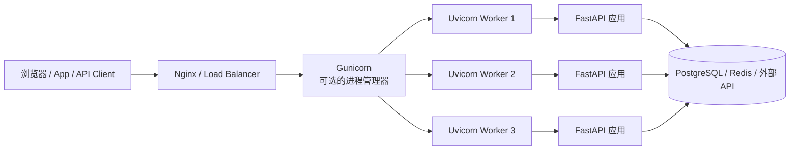

三者的职责可以概括为：

| 组件 | 类型 | 主要职责 | 是否编写业务代码 |
|---|---|---|---|
| FastAPI | Web 框架 | 路由、参数校验、依赖注入、业务逻辑、OpenAPI 文档 | 是 |
| Uvicorn | ASGI Server | 接收网络请求，运行 FastAPI、Starlette、Django ASGI 等应用 | 否 |
| Gunicorn | Process Manager / WSGI Server | 管理多个 Worker、超时、信号、平滑重启和进程生命周期 | 否 |
| Nginx | 反向代理 | HTTPS、静态资源、限流、请求转发、负载均衡 | 否 |

可以把它们类比成一家餐厅：

| 技术组件 | 餐厅类比 |
|---|---|
| FastAPI | 厨房与菜谱，决定如何处理订单 |
| Uvicorn | 服务员，负责接收订单并把菜送给客人 |
| Gunicorn | 店长，负责管理多个服务员和排班 |
| Nginx | 前台与门店入口，负责接待、分流和安全检查 |

---

## 2. FastAPI 是什么

FastAPI 是一个基于 Python 类型注解构建的现代 Web API 框架，底层依赖 Starlette 和 Pydantic。

它主要解决的是应用层问题：

- 定义 HTTP 路由；
- 解析路径、查询和请求体参数；
- 基于类型注解执行数据校验；
- 生成 OpenAPI Schema；
- 自动生成 Swagger UI 和 ReDoc；
- 管理依赖注入；
- 处理认证、异常和中间件；
- 编写同步与异步接口。

一个最小 FastAPI 应用如下：

```python
from fastapi import FastAPI

app = FastAPI(title="Example API")


@app.get("/health")
async def health() -> dict[str, str]:
    return {"status": "ok"}
```

这里只定义了应用和路由，但它本身不会直接监听网络端口。

要让客户端能够访问它，还需要一个支持 ASGI 协议的服务器，例如 Uvicorn。

---

## 3. Uvicorn 是什么

Uvicorn 是一个 ASGI Server。

它负责：

- 监听 IP 和端口；
- 接收 HTTP 请求；
- 处理 HTTP/1.1、WebSocket 等协议；
- 把请求转换为 ASGI 消息；
- 调用 FastAPI 应用；
- 把应用响应写回客户端；
- 管理事件循环和连接生命周期。

运行 FastAPI：

```bash
uvicorn main:app --host 0.0.0.0 --port 8000
```

其中：

| 参数 | 含义 |
|---|---|
| `main` | Python 模块，即 `main.py` |
| `app` | 模块中的 FastAPI 应用对象 |
| `--host 0.0.0.0` | 监听所有网络接口 |
| `--port 8000` | 监听 8000 端口 |

`main:app` 等价于：

```python
from main import app
```

### 3.1 开发环境启动

```bash
uvicorn main:app --reload
```

或者使用 FastAPI CLI：

```bash
fastapi dev main.py
```

`--reload` 会监控源代码变化并自动重启服务，适合本地开发，但不应在生产环境使用。

### 3.2 生产环境多进程启动

```bash
uvicorn main:app \
  --host 0.0.0.0 \
  --port 8000 \
  --workers 4
```

Uvicorn 当前已经具备多 Worker 管理能力，因此在很多部署场景中，不再必须额外引入 Gunicorn。

---

## 4. Gunicorn 是什么

Gunicorn 的全称是 Green Unicorn。

它最初是面向 WSGI 应用设计的 Python HTTP Server 和进程管理器，常用于运行 Flask 和 Django WSGI 应用。

Gunicorn 的核心能力包括：

- 启动多个 Worker 进程；
- 监控 Worker 状态；
- Worker 异常退出后自动拉起；
- 配置请求超时；
- 接收 Unix 信号；
- 平滑重启 Worker；
- 支持不同 Worker 类型；
- 通过 Pre-fork 模型利用多核 CPU。

传统 Flask 应用常这样启动：

```bash
gunicorn app:app --workers 4 --bind 0.0.0.0:8000
```

传统 Django WSGI 应用常这样启动：

```bash
gunicorn config.wsgi:application \
  --workers 4 \
  --bind 0.0.0.0:8000
```

Gunicorn 默认 Worker 使用 WSGI 协议，不能直接运行原生 ASGI 应用。

因此，过去部署 FastAPI 时，通常让 Gunicorn 负责管理进程，让 Uvicorn Worker 负责运行 ASGI 应用：

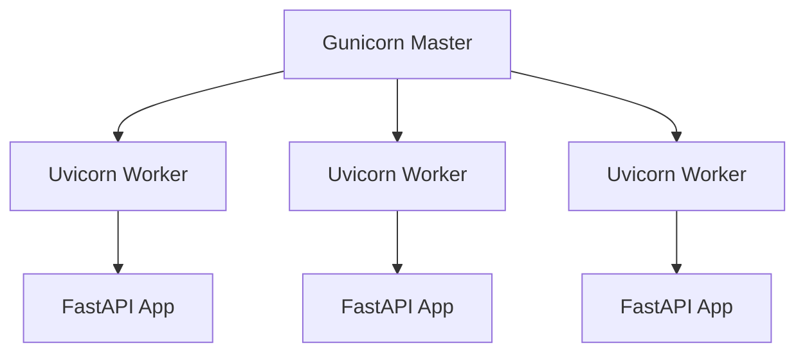

---

## 5. FastAPI + Uvicorn + Gunicorn 如何协作

请求进入系统后的完整链路如下：

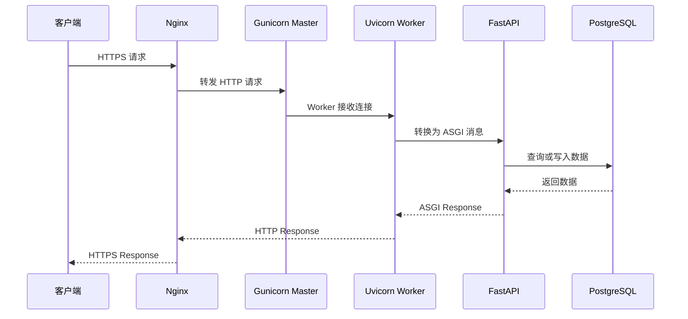

需要注意，Gunicorn Master 通常并不亲自处理业务请求，它主要管理 Worker 进程。

真正处理 FastAPI 请求的是 Uvicorn Worker。

---

## 6. WSGI 与 ASGI 的区别

理解 Flask、Django、FastAPI 的差异，关键在于理解 WSGI 和 ASGI。

### 6.1 WSGI

WSGI 是 Python Web Server Gateway Interface。

它定义了 Web Server 和 Python Web 应用之间的同步调用接口。

典型链路：


WSGI 的典型特点：

- 同步请求模型；
- 一个 Worker 在同一时刻通常处理一个请求；
- 适合传统页面、CRUD 和同步数据库访问；
- 不原生支持 WebSocket；
- 长连接和大量并发 I/O 需要线程、进程或 gevent 等方案。

### 6.2 ASGI

ASGI 是 Asynchronous Server Gateway Interface。

它不仅支持同步 HTTP 请求，还支持异步请求、WebSocket、长连接和应用生命周期事件。

典型链路：


### 6.3 核心对比

| 维度 | WSGI | ASGI |
|---|---|---|
| 编程模型 | 以同步为主 | 同步与异步均可 |
| 长连接 | 支持较弱 | 原生支持 |
| WebSocket | 不原生支持 | 原生支持 |
| 高并发 I/O | 通常依赖更多进程、线程或协程库 | 适合 `asyncio` 并发 |
| 生命周期事件 | 标准能力有限 | 原生支持 startup、shutdown、lifespan |
| 典型服务器 | Gunicorn、uWSGI、Waitress | Uvicorn、Hypercorn、Daphne |
| 典型框架 | Flask、传统 Django | FastAPI、Starlette、Django ASGI |

---

## 7. FastAPI、Flask、Django 的定位对比

FastAPI、Flask、Django 都是优秀的 Python Web 框架，但目标不同。

| 维度 | FastAPI | Flask | Django |
|---|---|---|---|
| 主要定位 | API 与微服务 | 轻量 Web 框架 | 全功能 Web 框架 |
| 默认接口 | ASGI | WSGI | 同时支持 WSGI 和 ASGI |
| 异步支持 | 原生、优先 | 支持，但不是 async-first | 支持 ASGI，部分生态仍以同步为主 |
| 数据校验 | Pydantic 自动校验 | 通常手动或使用扩展 | Form、Serializer 或第三方库 |
| API 文档 | 自动生成 OpenAPI | 依赖扩展 | Django REST Framework 可提供 |
| ORM | 不内置 | 不内置 | 内置 Django ORM |
| 管理后台 | 不内置 | 不内置 | 内置 Admin |
| 用户认证 | 提供基础组件，需自行组合 | 依赖扩展或自行实现 | 内置认证与权限基础设施 |
| 模板系统 | 可选 | 内置 Jinja 集成 | 内置 Django Template |
| 项目约束 | 较灵活 | 非常灵活 | 约定和结构更完整 |
| 学习曲线 | 中等 | 较低 | 较高 |
| 典型场景 | AI API、微服务、实时接口 | 小型服务、原型、传统网站 | 内容系统、后台系统、大型业务平台 |

---

## 8. FastAPI 相比 Flask 的优势与代价

### 8.1 FastAPI 的优势

#### 自动参数校验

```python
from fastapi import FastAPI
from pydantic import BaseModel

app = FastAPI()


class UserCreate(BaseModel):
    name: str
    age: int


@app.post("/users")
async def create_user(user: UserCreate) -> UserCreate:
    return user
```

FastAPI 会自动完成：

- JSON 解析；
- 字段类型校验；
- 缺失字段检查；
- 错误响应生成；
- OpenAPI Schema 生成。

Flask 中通常需要手动解析并校验，或者引入 Marshmallow、Pydantic 等库。

#### 更适合异步 I/O

FastAPI 适合大量等待型任务：

- 调用大模型 API；
- 调用多个微服务；
- 异步访问 PostgreSQL；
- 读写 Redis；
- 文件上传；
- Server-Sent Events；
- WebSocket；
- AI Token Streaming。

#### 自动 API 文档

默认可访问：

```text
/docs
/redoc
/openapi.json
```

### 8.2 FastAPI 的代价

- 异步代码需要理解事件循环；
- 同步和异步库混用时容易阻塞 Event Loop；
- Pydantic 模型较多时项目结构可能变复杂；
- 如果业务是简单同步 CRUD，性能优势可能并不明显；
- CPU 密集任务仍然需要进程池、任务队列或独立服务。

---

## 9. FastAPI 相比 Django 的优势与代价

### 9.1 FastAPI 更适合

- 独立 API 服务；
- AI Agent 服务；
- RAG 检索服务；
- 模型推理接口；
- 微服务；
- 异步聚合多个外部 API；
- WebSocket 和流式响应；
- 前后端分离系统。

### 9.2 Django 更适合

- 需要完整后台管理系统；
- 内容管理平台；
- CRM、ERP、运营后台；
- 权限、用户、Session、Form 较复杂；
- 服务端模板渲染；
- 希望使用统一 ORM、迁移和 Admin 生态。

### 9.3 不要简单理解为 FastAPI 一定比 Django 快

性能最终取决于：

- 数据库查询；
- 网络延迟；
- 序列化；
- 缓存策略；
- Worker 数量；
- 是否存在同步阻塞；
- 中间件；
- ORM 使用方式；
- 部署架构；
- 实际负载模型。

框架基准测试并不能直接代表真实业务性能。

---

## 10. 同步与异步接口应该怎样选择

FastAPI 同时支持：

```python
@app.get("/sync")
def sync_endpoint():
    return {"mode": "sync"}
```

和：

```python
@app.get("/async")
async def async_endpoint():
    return {"mode": "async"}
```

### 10.1 适合 `async def` 的场景

- 使用异步数据库驱动；
- 使用 `httpx.AsyncClient`；
- 异步 Redis；
- WebSocket；
- SSE 流式输出；
- 同时调用多个外部服务。

```python
import asyncio
import httpx
from fastapi import FastAPI

app = FastAPI()


@app.get("/aggregate")
async def aggregate():
    async with httpx.AsyncClient() as client:
        user_task = client.get("https://example.com/users")
        order_task = client.get("https://example.com/orders")
        users, orders = await asyncio.gather(user_task, order_task)

    return {
        "users": users.json(),
        "orders": orders.json(),
    }
```

### 10.2 不能直接放进事件循环的任务

以下任务可能阻塞 Event Loop：

- 使用 `requests` 发起网络请求；
- 使用同步数据库驱动；
- 大量 Pandas 计算；
- 图像处理；
- 模型本地推理；
- 大量 JSON 或文本处理；
- CPU 密集循环。

错误示例：

```python
import requests


@app.get("/blocked")
async def blocked():
    response = requests.get("https://example.com")
    return response.json()
```

更合理的做法包括：

- 使用异步库；
- 把同步接口声明为普通 `def`；
- 使用线程池；
- 使用进程池；
- 使用 Celery、Dramatiq、RQ 等任务队列；
- 将推理任务拆分为独立模型服务。

---

## 11. 是否还需要 Gunicorn

这是目前部署 FastAPI 时最容易使用过时经验的地方。

过去常见的生产命令是：

```bash
gunicorn main:app \
  --worker-class uvicorn.workers.UvicornWorker \
  --workers 4 \
  --bind 0.0.0.0:8000
```

但当前部署思路已经发生变化：

- Uvicorn 自身支持 `--workers`；
- FastAPI CLI 支持生产模式和多 Worker；
- 在 Kubernetes 中通常使用一个容器一个 Uvicorn 进程；
- 由 Kubernetes、ECS、Nomad 或云平台负责副本和重启；
- FastAPI 官方旧的 `tiangolo/uvicorn-gunicorn-fastapi` 基础镜像已经弃用。

因此，Gunicorn 是一个可选项，而不是 FastAPI 的必需组件。

### 11.1 推荐使用 Uvicorn 的场景

```bash
uvicorn app.main:app \
  --host 0.0.0.0 \
  --port 8000 \
  --workers 4
```

适合：

- 单机 Docker；
- 简单云服务器；
- systemd 管理的服务；
- 不需要 Gunicorn 特殊进程管理能力；
- 希望减少部署组件。

### 11.2 推荐单进程 Uvicorn 的场景

```bash
uvicorn app.main:app --host 0.0.0.0 --port 8000
```

适合：

- Kubernetes；
- ECS、Cloud Run 等容器平台；
- 平台已经负责多副本、健康检查和自动重启；
- 希望每个容器资源边界清晰。

### 11.3 仍可考虑 Gunicorn 的场景

- 已有成熟 Gunicorn 运维体系；
- 非容器 Linux 虚拟机；
- 需要统一管理 Flask、Django 和 FastAPI 服务；
- 依赖 Gunicorn 的信号、超时和 Worker 生命周期配置；
- 团队已有完整的 Gunicorn 配置和监控。

---

## 12. 现代部署方案对比

| 场景 | 推荐启动方式 | 进程扩展由谁负责 |
|---|---|---|
| 本地开发 | `fastapi dev` 或 `uvicorn --reload` | 无需扩展 |
| 单机小型服务 | `uvicorn --workers N` | Uvicorn |
| 传统虚拟机 | Uvicorn Workers 或 Gunicorn + Uvicorn Worker | Uvicorn 或 Gunicorn |
| 单机 Docker | 单进程或多 Worker Uvicorn | 容器或 Uvicorn |
| Docker Compose | 每容器单进程，或单容器多 Worker | Compose / Uvicorn |
| Kubernetes | 每 Pod 单 Uvicorn 进程 | Deployment / HPA |
| Serverless Container | 单 Uvicorn 进程 | 云平台 |
| Flask WSGI | Gunicorn | Gunicorn |
| Django WSGI | Gunicorn | Gunicorn |
| Django ASGI | Uvicorn、Daphne、Hypercorn 等 | ASGI Server 或容器平台 |

---

## 13. 传统虚拟机部署架构

在 Ubuntu、EC2 或普通云服务器上，可以使用：

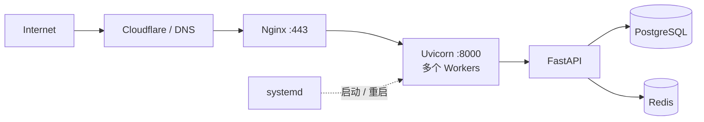

### 13.1 systemd 示例

```ini
[Unit]
Description=FastAPI Service
After=network.target

[Service]
User=ubuntu
WorkingDirectory=/srv/my-api
Environment="PATH=/srv/my-api/.venv/bin"
ExecStart=/srv/my-api/.venv/bin/uvicorn app.main:app \
  --host 127.0.0.1 \
  --port 8000 \
  --workers 4
Restart=always
RestartSec=3

[Install]
WantedBy=multi-user.target
```

### 13.2 Nginx 示例

```nginx
server {
    listen 80;
    server_name api.example.com;

    location / {
        proxy_pass http://127.0.0.1:8000;
        proxy_http_version 1.1;

        proxy_set_header Host $host;
        proxy_set_header X-Real-IP $remote_addr;
        proxy_set_header X-Forwarded-For $proxy_add_x_forwarded_for;
        proxy_set_header X-Forwarded-Proto $scheme;

        proxy_set_header Upgrade $http_upgrade;
        proxy_set_header Connection "upgrade";
    }
}
```

---

## 14. Docker 部署示例

结合 uv 管理依赖，可以使用：

```dockerfile
FROM python:3.12-slim

WORKDIR /app

COPY --from=ghcr.io/astral-sh/uv:latest /uv /uvx /bin/

COPY pyproject.toml uv.lock ./
RUN uv sync --frozen --no-dev

COPY app ./app

ENV PATH="/app/.venv/bin:$PATH"

EXPOSE 8000

CMD ["uvicorn", "app.main:app", "--host", "0.0.0.0", "--port", "8000"]
```

在 Kubernetes 中，通常保持每个容器一个 Uvicorn 进程：

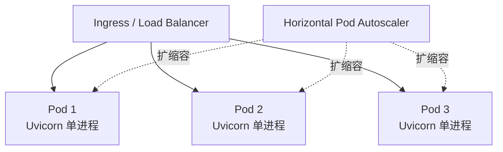

这样做的优点是：

- 容器资源更容易估算；
- Pod 崩溃可由平台重建；
- 副本数由平台统一控制；
- 避免容器内多进程和集群副本双重扩展；
- 日志和监控粒度更清晰。

---

## 15. Worker 数量应该设置多少

不存在适用于所有项目的固定公式。

过去常见经验是：

```text
workers = CPU 核数 × 2 + 1
```

但这只是历史经验，不应机械套用。

FastAPI 服务的 Worker 数量取决于：

- 请求是 I/O 密集还是 CPU 密集；
- 单个 Worker 的内存占用；
- 数据库连接池大小；
- 模型是否加载到每个进程；
- 是否使用 GPU；
- 请求体大小；
- P95、P99 延迟目标；
- 容器 CPU 和内存限制。

### 15.1 多 Worker 的内存代价

每个 Worker 是独立进程：

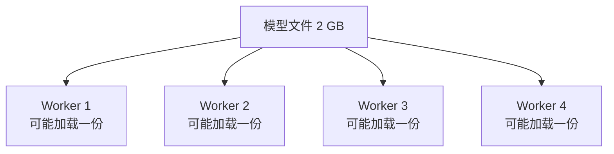

如果每个 Worker 都加载一个 2 GB 的模型，4 个 Worker 可能需要接近 8 GB 甚至更多内存或显存。

对于 AI 推理服务，Worker 数量通常不能只根据 CPU 核数决定。

### 15.2 正确方法：压测

建议至少测试：

| 配置 | QPS | P50 | P95 | P99 | CPU | 内存 |
|---|---:|---:|---:|---:|---:|---:|
| 1 Worker | 待测 | 待测 | 待测 | 待测 | 待测 | 待测 |
| 2 Workers | 待测 | 待测 | 待测 | 待测 | 待测 | 待测 |
| 4 Workers | 待测 | 待测 | 待测 | 待测 | 待测 | 待测 |
| 8 Workers | 待测 | 待测 | 待测 | 待测 | 待测 | 待测 |

选择吞吐、延迟、内存和稳定性之间最合适的配置。

---

## 16. 数据库连接池与 Worker 的关系

假设：

```text
4 个 Worker × 每个 Worker 20 个数据库连接 = 80 个连接
```

如果 PostgreSQL 最大连接数只有 100，再加上：

- 后台任务；
- 管理工具；
- 数据同步程序；
- BI 报表；
- 其他微服务；

数据库连接很容易耗尽。

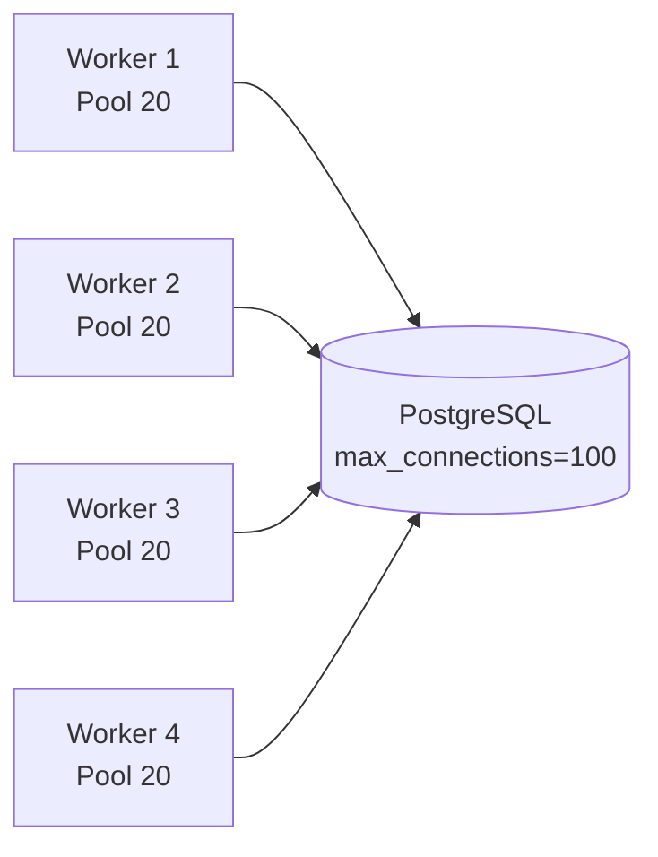

因此，增加 Worker 时必须同时检查：

- SQLAlchemy Pool Size；
- Overflow；
- PostgreSQL `max_connections`；
- PgBouncer；
- Redis 连接池；
- 外部 API 并发限制。

---

## 17. Gunicorn 配置示例

对于仍希望使用 Gunicorn 的团队，可以使用独立配置文件。

```python
# gunicorn.conf.py
import multiprocessing

bind = "0.0.0.0:8000"
workers = max(2, multiprocessing.cpu_count())
worker_class = "uvicorn_worker.UvicornWorker"
timeout = 60
graceful_timeout = 30
keepalive = 5
accesslog = "-"
errorlog = "-"
loglevel = "info"
```

启动：

```bash
gunicorn app.main:app --config gunicorn.conf.py
```

注意：

- 历史上的 `uvicorn.workers.UvicornWorker` 已进入弃用迁移阶段；
- 新项目应优先查看独立的 `uvicorn-worker` 包及其当前文档；
- 对大多数现代容器部署，直接使用 Uvicorn 往往更简单。

---

## 18. Flask、Django 的生产部署方式

### 18.1 Flask

Flask 自带的开发服务器不能用于生产环境。

生产环境常见方式：

```bash
gunicorn app:app --workers 4 --bind 0.0.0.0:8000
```

架构：

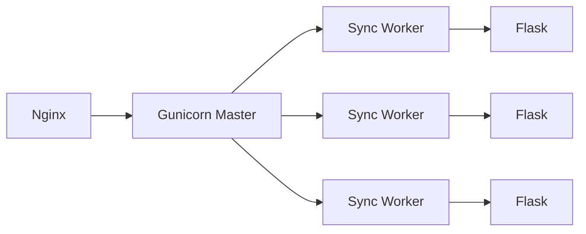

Flask 支持 `async def` 视图，但它不是原生 async-first 的 ASGI 框架。对于大量长连接、WebSocket 和异步任务，可考虑 FastAPI、Starlette 或 Quart。

### 18.2 Django WSGI

```bash
gunicorn config.wsgi:application \
  --workers 4 \
  --bind 0.0.0.0:8000
```

适合传统 Django 页面和同步 API。

### 18.3 Django ASGI

Django 同时支持 ASGI，可以使用 Uvicorn 等 ASGI Server：

```bash
uvicorn config.asgi:application \
  --host 0.0.0.0 \
  --port 8000
```

Django 的异步能力正在持续完善，但项目中的第三方中间件、数据库操作和业务代码是否真正异步，仍需逐项确认。

---

## 19. 框架选型决策树

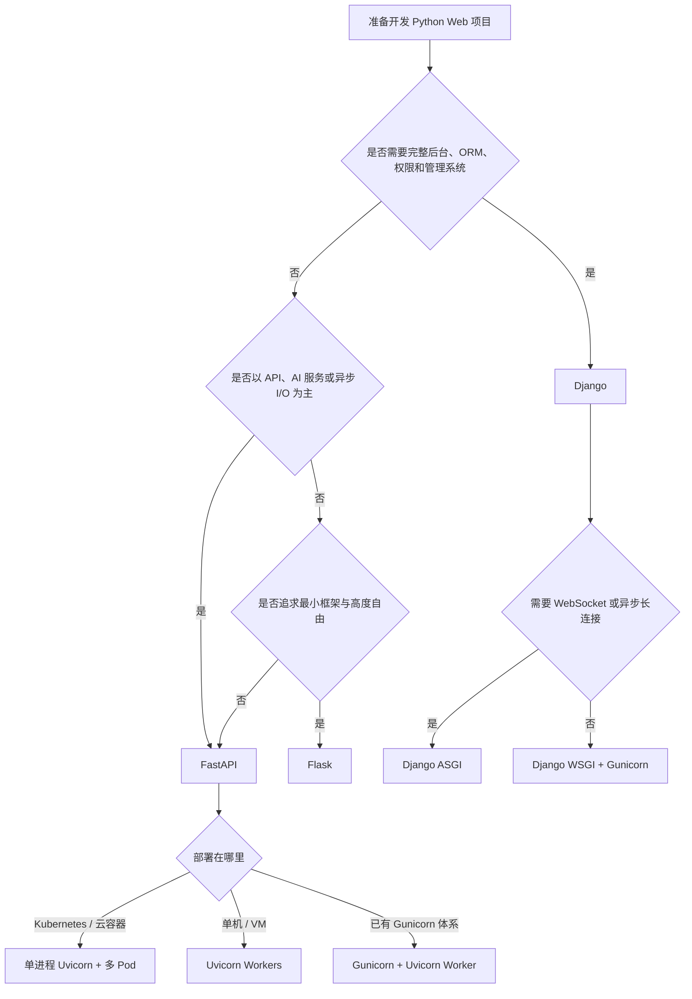

---

## 20. 不同项目的推荐方案

| 项目类型 | 推荐技术方案 |
|---|---|
| AI Agent API | FastAPI + Uvicorn + PostgreSQL/Redis |
| RAG 检索服务 | FastAPI + Uvicorn + PGVector + 异步数据库驱动 |
| LLM Token Streaming | FastAPI + Uvicorn + SSE/WebSocket |
| 小型内部工具 | Flask + Gunicorn，或 FastAPI + Uvicorn |
| 内容管理平台 | Django + Gunicorn |
| 企业运营后台 | Django + Django Admin + Gunicorn |
| 高并发 WebSocket | FastAPI/Starlette + Uvicorn |
| 传统服务端渲染网站 | Django 或 Flask |
| Kubernetes 微服务 | FastAPI + 单进程 Uvicorn + 多 Pod |
| CPU 密集数据计算 | Web API + 独立任务队列或计算服务 |

---

## 21. 一个适合 AI 应用的项目结构

```text
my-ai-api/
├── app/
│   ├── __init__.py
│   ├── main.py
│   ├── api/
│   │   ├── __init__.py
│   │   ├── dependencies.py
│   │   └── routes/
│   │       ├── health.py
│   │       ├── chat.py
│   │       └── rag.py
│   ├── core/
│   │   ├── config.py
│   │   ├── logging.py
│   │   └── security.py
│   ├── db/
│   │   ├── session.py
│   │   ├── models.py
│   │   └── repositories/
│   ├── schemas/
│   ├── services/
│   │   ├── llm_service.py
│   │   ├── embedding_service.py
│   │   └── retrieval_service.py
│   └── workers/
├── tests/
├── pyproject.toml
├── uv.lock
├── Dockerfile
├── docker-compose.yml
└── README.md
```

`app/main.py`：

```python
from contextlib import asynccontextmanager
from fastapi import FastAPI

from app.api.routes import chat, health, rag


@asynccontextmanager
async def lifespan(app: FastAPI):
    # 初始化数据库连接池、HTTP Client、模型客户端等
    yield
    # 关闭连接池并释放资源


app = FastAPI(
    title="AI Service API",
    version="1.0.0",
    lifespan=lifespan,
)

app.include_router(health.router, prefix="/health", tags=["Health"])
app.include_router(chat.router, prefix="/api/chat", tags=["Chat"])
app.include_router(rag.router, prefix="/api/rag", tags=["RAG"])
```

---

## 22. 常见误区

### 误区一：FastAPI 自己就是 Web Server

FastAPI 是应用框架，需要 Uvicorn 等 ASGI Server 才能监听端口。

### 误区二：Gunicorn 可以直接运行所有 ASGI 应用

Gunicorn 默认面向 WSGI，需要合适的 ASGI Worker 才能运行 FastAPI。

### 误区三：写了 `async def` 就一定更快

如果函数内部使用同步阻塞库，反而可能阻塞整个事件循环。

### 误区四：Worker 越多越快

Worker 过多会增加：

- 内存占用；
- 数据库连接；
- 上下文切换；
- 模型重复加载；
- CPU 竞争。

### 误区五：生产环境直接使用 `--reload`

`--reload` 只适合开发环境，会增加资源消耗并降低稳定性。

### 误区六：FastAPI 一定比 Flask、Django 快

框架只是系统的一部分。真实瓶颈更可能出现在数据库、网络、缓存、序列化和业务逻辑中。

### 误区七：Kubernetes Pod 内仍必须运行大量 Worker

在 Kubernetes 中，通常优先通过增加 Pod 副本实现扩展，而不是在单个 Pod 内堆叠大量进程。

---

## 23. 监控与性能指标

生产环境至少应监控：

| 分类 | 指标 |
|---|---|
| 流量 | QPS、并发连接数、请求体大小 |
| 延迟 | P50、P95、P99、首 Token 延迟 |
| 错误 | 4xx、5xx、超时、异常类型 |
| Worker | Worker 数量、重启次数、超时退出 |
| CPU | 使用率、Load Average、Context Switch |
| 内存 | RSS、OOM、单 Worker 内存 |
| 数据库 | 连接池使用率、慢 SQL、等待时间 |
| 外部服务 | LLM 延迟、重试次数、限流次数 |
| Event Loop | Lag、阻塞时间、任务队列长度 |

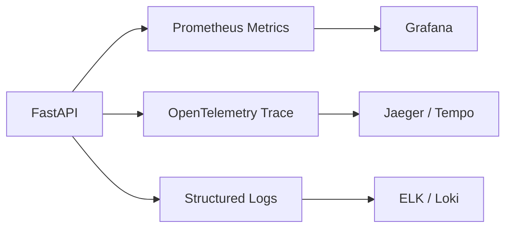

---

## 24. 推荐的学习路线

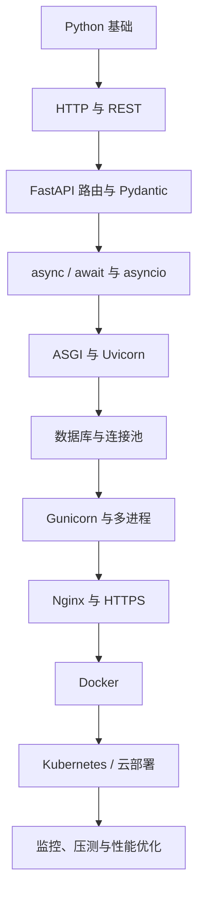

建议重点掌握：

1. HTTP 请求生命周期；
2. WSGI 和 ASGI 的职责边界；
3. 同步与异步 I/O；
4. Event Loop 阻塞问题；
5. 进程、线程与协程；
6. 数据库连接池；
7. Nginx 反向代理；
8. Docker 和 Kubernetes 扩缩容；
9. P95、P99 与压测；
10. 日志、指标和链路追踪。

---

## 25. 最终总结

FastAPI、Uvicorn 和 Gunicorn 各自处于不同层级：

```text
FastAPI：定义应用如何处理请求
Uvicorn：让 ASGI 应用能够接收网络请求
Gunicorn：可选地管理多个 Worker 进程
Nginx：处理外部入口、HTTPS 和反向代理
```

传统 Flask 和 Django 项目通常建立在 WSGI 生态上，因此经常使用 Gunicorn。

FastAPI 建立在 ASGI 生态上，通常使用 Uvicorn。随着 Uvicorn 自身多 Worker 能力和容器编排平台逐渐成熟，Gunicorn 对 FastAPI 已从“常见标准组合”变成“特定场景下的可选组件”。

可以使用下面的原则做出选择：

| 场景 | 推荐方案 |
|---|---|
| 本地开发 | FastAPI + Uvicorn `--reload` |
| 单机生产 | FastAPI + Uvicorn Workers |
| 传统 VM 且已有成熟运维体系 | FastAPI + Gunicorn + Uvicorn Worker |
| Kubernetes | FastAPI + 单进程 Uvicorn + 多 Pod |
| Flask | Flask + Gunicorn |
| Django 传统应用 | Django WSGI + Gunicorn |
| Django 异步应用 | Django ASGI + Uvicorn/Daphne/Hypercorn |

最重要的不是机械记住某条启动命令，而是理解每一层组件的职责：

> 框架负责业务，服务器负责协议，进程管理器负责进程，反向代理负责入口，容器平台负责扩缩容和故障恢复。

理解这条边界之后，FastAPI、Flask、Django、Uvicorn 和 Gunicorn 的组合就不再混乱。

---

## 参考资料

- FastAPI 官方文档：<https://fastapi.tiangolo.com/>
- FastAPI 手动运行服务器：<https://fastapi.tiangolo.com/deployment/manually/>
- FastAPI Server Workers：<https://fastapi.tiangolo.com/deployment/server-workers/>
- FastAPI Docker 部署：<https://fastapi.tiangolo.com/deployment/docker/>
- Uvicorn 官方文档：<https://www.uvicorn.org/>
- Gunicorn 官方文档：<https://docs.gunicorn.org/>
- Flask 生产部署：<https://flask.palletsprojects.com/en/stable/deploying/>
- Flask Async 支持：<https://flask.palletsprojects.com/en/stable/async-await/>
- Django 部署文档：<https://docs.djangoproject.com/en/6.0/howto/deployment/>
- Django 异步支持：<https://docs.djangoproject.com/en/6.0/topics/async/>
