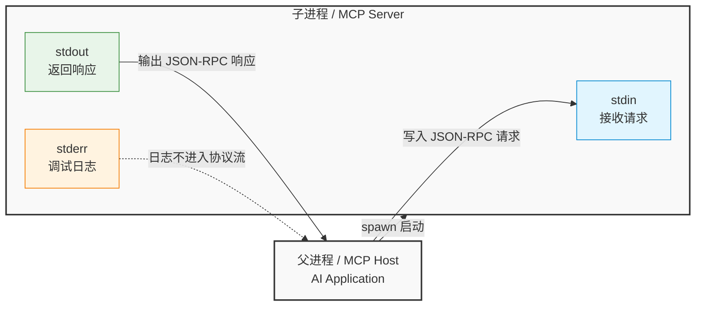
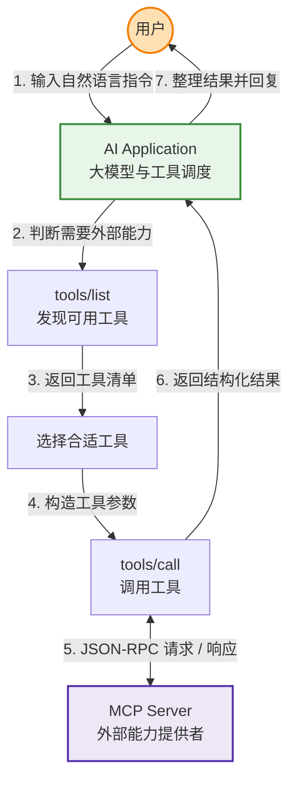
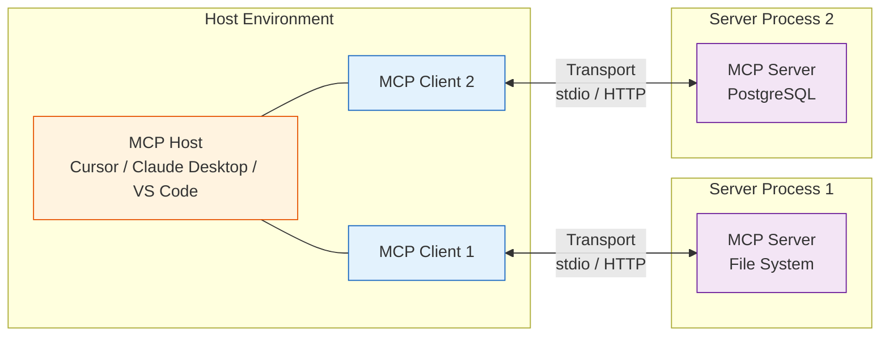

# MCP (Model Context Protocol) 底层原理与实战开发指南

本指南从操作系统的进程间通信（IPC）出发，逐步推演 JSON-RPC 协议，并最终落地到现代 AI 基础设施 MCP（Model Context Protocol，模型上下文协议）的核心规范与开发实践。

无论你是前端、后端还是 AI 应用开发者，理解这些底层原理都能帮助你更稳定地构建 AI Agent 工具链。

## 一、核心基石：进程与 Stdio 标准流

MCP 在本地 stdio 模式下的本质，是**父进程与子进程之间基于标准输入输出流的结构化通信**。

### 1. 进程隔离与标准流

- **进程隔离**：操作系统中，进程之间的内存空间相互隔离，不能直接读取对方的数据。
- **标准流**：每个控制台进程启动时，操作系统通常会为它分配三个标准通信通道：
  - `stdin`：标准输入（Standard Input）
  - `stdout`：标准输出（Standard Output）
  - `stderr`：标准错误（Standard Error）

### 2. 父子进程协作模型

在 MCP 架构中，AI 应用（如 Cursor、Claude Desktop、VS Code 等）通常作为**父进程 / Host**，通过执行命令启动我们编写的 MCP Server。Host 将 JSON-RPC 请求写入 Server 的 `stdin`，并从 Server 的 `stdout` 读取 JSON-RPC 响应。



最早的进程通信也可以只是简单文本，例如直接发送 `今天下雨吗？`。但自然语言不利于机器稳定解析复杂指令、参数和错误，因此 MCP 使用 JSON-RPC 2.0 作为底层消息格式。

## 二、通信规范：JSON-RPC 2.0

JSON-RPC 2.0 是一种轻量级远程过程调用（RPC）协议。它规定请求、响应和错误都必须使用结构化 JSON 表达。

### 1. 请求格式

下面是合法 JSON。注意：标准 JSON 不允许注释，所以说明文字放在代码块外部。

```json
{
  "jsonrpc": "2.0",
  "method": "writeFile",
  "params": {
    "path": "./test.txt",
    "content": "hello world\n"
  },
  "id": 2
}
```

字段说明：

- `jsonrpc`：协议版本，固定为 `"2.0"`。
- `method`：要调用的方法名。
- `params`：参数对象，可以是对象或数组。
- `id`：请求 ID，用于匹配异步响应。

### 2. 成功响应

```json
{
  "jsonrpc": "2.0",
  "result": true,
  "id": 2
}
```

### 3. 错误响应

当工具执行失败时，应该返回标准错误对象，而不是把错误塞进 `result`。

```json
{
  "jsonrpc": "2.0",
  "error": {
    "code": -32601,
    "message": "Method not found"
  },
  "id": 3
}
```

常见 JSON-RPC 错误码：

| 错误码 | 含义 |
| --- | --- |
| `-32700` | Parse error，JSON 解析失败 |
| `-32600` | Invalid Request，请求格式不合法 |
| `-32601` | Method not found，方法不存在 |
| `-32602` | Invalid params，参数不合法 |
| `-32603` | Internal error，内部错误 |

### 4. Notification：无响应消息

如果请求没有 `id`，它就是 notification。接收方不应该返回响应。

```json
{
  "jsonrpc": "2.0",
  "method": "notifications/initialized",
  "params": {}
}
```

## 三、MCP 核心概念与架构

MCP 是构建在 JSON-RPC 2.0 与传输层（stdio、Streamable HTTP 等）之上的一层 AI 工具上下文协议。它让 AI 应用可以通过统一接口发现工具、读取资源、使用提示模板，并调用外部能力。

### 1. 典型工具调用工作流



### 2. Host、Client、Server 的关系

真实运行环境中，通常是一个 MCP Host 连接多个 MCP Server。Host 内部可以为每个 Server 维护一个 MCP Client，用于协议协商、能力发现和消息收发。



核心角色：

- **MCP Host**：发起工具调用的 AI 应用，例如 Cursor、Claude Desktop、VS Code。
- **MCP Client**：Host 内部的协议客户端，负责与某个 MCP Server 通信。
- **MCP Server**：暴露工具、资源或提示模板的外部服务。
- **Transport Layer**：传输层。本地开发常用 `stdio`，远程服务可使用 HTTP 传输。

## 四、MCP 能力模型

MCP Server 常见能力包括：

- **Tools**：可被模型调用的动作，例如查询数据库、发送邮件、读写文件。
- **Resources**：可被 Host 或模型读取的上下文数据，例如文件、数据库记录、接口返回值。
- **Prompts**：可复用的提示模板，用于封装固定工作流或上下文。

最常见的入门场景是开发一个 Tool，因为它最像传统后端接口：定义名称、描述、输入参数 schema，然后返回结构化结果。

## 五、实战：Node.js / TypeScript 版本

### 1. 安装依赖

```bash
npm init -y
npm install @modelcontextprotocol/sdk zod
npm install -D typescript tsx @types/node
```

### 2. 创建 `server.ts`

```ts
import { McpServer } from "@modelcontextprotocol/sdk/server/mcp.js";
import { StdioServerTransport } from "@modelcontextprotocol/sdk/server/stdio.js";
import { z } from "zod";

const server = new McpServer({
  name: "demo-node-mcp-server",
  version: "1.0.0"
});

server.registerTool(
  "add",
  {
    title: "Add two numbers",
    description: "Return the sum of two numbers.",
    inputSchema: {
      a: z.number(),
      b: z.number()
    }
  },
  async ({ a, b }) => {
    return {
      content: [
        {
          type: "text",
          text: String(a + b)
        }
      ]
    };
  }
);

const transport = new StdioServerTransport();
await server.connect(transport);
```

### 3. 启动命令

```bash
npx tsx server.ts
```

开发 MCP Server 时，普通调试信息请写入 `stderr`：

```ts
console.error("debug: server started");
```

不要在 stdio 模式下使用 `console.log` 打印调试信息，因为 `stdout` 是 JSON-RPC 协议通道。

## 六、实战：Python 版本

### 1. 安装依赖

推荐使用 `uv`：

```bash
uv init demo-python-mcp-server
cd demo-python-mcp-server
uv add "mcp[cli]"
```

也可以使用 `pip`：

```bash
python -m venv .venv
source .venv/bin/activate
pip install "mcp[cli]"
```

### 2. 创建 `server.py`

```python
from mcp.server.fastmcp import FastMCP

mcp = FastMCP("demo-python-mcp-server")


@mcp.tool()
def add(a: int, b: int) -> int:
    """Return the sum of two numbers."""
    return a + b


@mcp.tool()
def echo(text: str) -> str:
    """Echo the input text."""
    return text


if __name__ == "__main__":
    mcp.run()
```

### 3. 启动命令

```bash
python server.py
```

如果使用 `uv` 管理项目：

```bash
uv run python server.py
```

## 七、宿主配置示例

不同客户端的配置文件位置略有差异，但核心配置都是声明 MCP Server 的启动命令与参数。

### 1. Node.js / TypeScript Server

```json
{
  "mcpServers": {
    "demo-node-server": {
      "command": "npx",
      "args": ["tsx", "/absolute/path/to/server.ts"]
    }
  }
}
```

### 2. Python Server

```json
{
  "mcpServers": {
    "demo-python-server": {
      "command": "python",
      "args": ["/absolute/path/to/server.py"]
    }
  }
}
```

### 3. 使用 `uv` 启动 Python Server

```json
{
  "mcpServers": {
    "demo-python-server": {
      "command": "uv",
      "args": [
        "--directory",
        "/absolute/path/to/demo-python-mcp-server",
        "run",
        "python",
        "server.py"
      ]
    }
  }
}
```

配置注意事项：

- JSON 配置中不要写注释。
- 路径建议使用绝对路径，避免客户端工作目录不同导致启动失败。
- 如果使用 `npx`，可以按需要加入 `-y`，例如 `["-y", "tsx", "/absolute/path/to/server.ts"]`。
- 如果客户端支持 `env` 字段，可以把密钥、数据库地址等敏感配置放到环境变量里。

## 八、调试与验证

### 1. 使用 MCP Inspector

Node.js 项目可以使用官方 Inspector 调试：

```bash
npx @modelcontextprotocol/inspector
```

Inspector 可以在不接入 AI 客户端的情况下，通过 Web UI 连接并测试 MCP Server。

### 2. Stdio 模式避坑

- `stdout` 只能输出 MCP 协议消息。
- 调试日志必须写到 `stderr`，Node.js 使用 `console.error`，Python 使用 `print(..., file=sys.stderr)` 或 `logging`。
- 不要在工具返回值中混入非结构化异常堆栈；异常应让 SDK 转成标准错误，或由工具捕获后返回清晰的业务结果。
- 参数 schema 要尽量明确，避免模型传入模糊参数。

Python 调试日志示例：

```python
import logging

logging.basicConfig(level=logging.INFO)
logging.info("server started")
```

## 九、行业项目落地案例

掌握 MCP 后，可以将它作为 LLM 工具链中的核心模块灵活复用。

示例：构建安全依赖审计工具 `Security-Check MCP Server`。

可暴露的工具：

- `scan_package_json`：解析 `package.json` 中的 `dependencies` 与 `devDependencies`。
- `check_npm_audit`：调用 npm 审计能力或内部漏洞数据库。
- `summarize_vulnerabilities`：把漏洞等级、影响范围和修复建议整理成结构化结果。

项目价值：

- 让 AI 编辑器可以直接在当前项目中执行依赖安全检查。
- 审计结果结构化，便于模型进一步解释、生成修复计划或打开 Pull Request。
- 可接入 Cursor、Claude Desktop、VS Code，也可以作为 LangChain、Dify 等平台下的工具服务。

## 十、官方资源导航

- MCP 官方文档：https://modelcontextprotocol.io/docs
- MCP TypeScript SDK：https://github.com/modelcontextprotocol/typescript-sdk
- MCP Python SDK：https://github.com/modelcontextprotocol/python-sdk
- MCP Inspector：https://github.com/modelcontextprotocol/inspector
- 开源 MCP Server 聚合站：https://mcpservers.org/
- 艾逗比开发的 MCP Server 聚合站:https://mcp.so/

