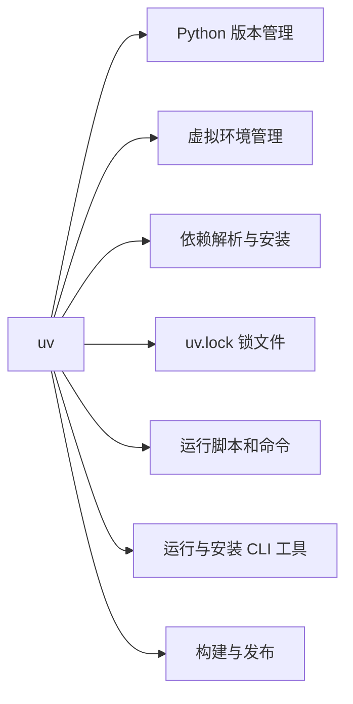
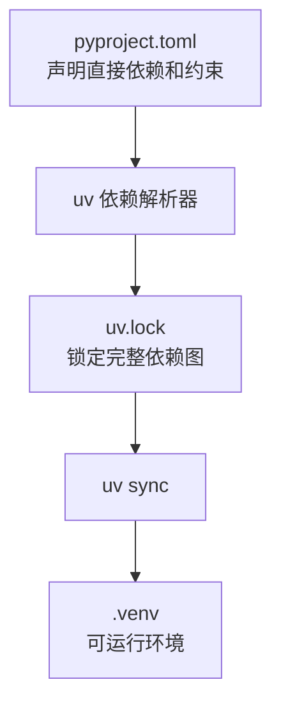
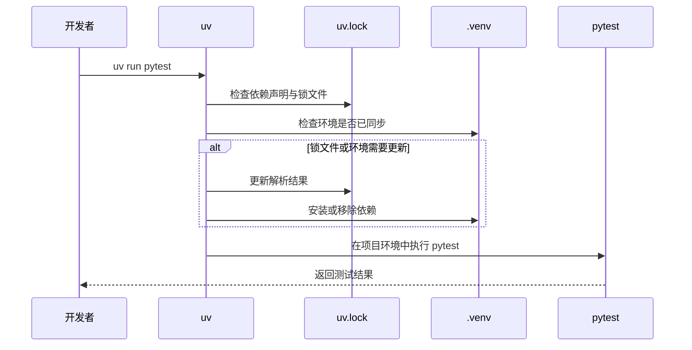
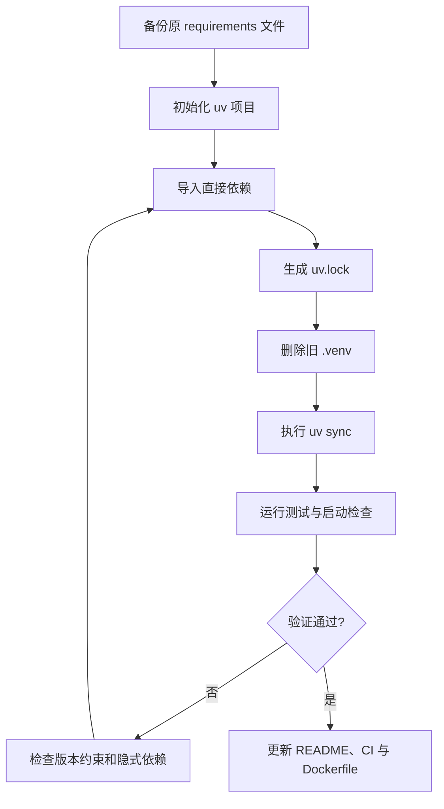

# Python 包管理工具 uv：从 pip 到现代化项目工作流

在 Python 项目中，依赖安装、虚拟环境、Python 版本、锁文件和命令行工具往往由不同工具分别管理：

- 使用 `pip` 安装依赖；
- 使用 `venv` 或 `virtualenv` 创建虚拟环境；
- 使用 `pip-tools` 生成锁定后的依赖文件；
- 使用 `pyenv` 管理多个 Python 版本；
- 使用 `pipx` 安装 Ruff、Black 等命令行工具；
- 使用 Poetry 或 PDM 管理完整项目生命周期。

这套组合能够完成工作，但随着项目增多，工具链也会越来越分散。开发者需要记住不同工具的命令、配置文件和行为差异，团队环境的一致性也更难保证。

`uv` 的目标，正是把这些常见能力整合进一个速度快、工作流统一的工具中。

> `uv` 是 Astral 团队使用 Rust 开发的 Python 包与项目管理工具。它既提供现代化的项目管理能力，也提供与 pip 类似的兼容接口。

---

## 1. 传统 Python 依赖管理有哪些痛点

`pip` 本身是成熟、可靠且使用广泛的包安装器。真正的问题通常不在于 pip “不能用”，而在于它只解决了 Python 工程链路中的一部分问题。

### 1.1 工具链比较分散

一个稍微规范的传统项目，可能需要执行：

```bash
# 创建虚拟环境
python -m venv .venv

# 激活虚拟环境：macOS / Linux
source .venv/bin/activate

# 安装依赖
pip install -r requirements.txt

# 安装新的包
pip install fastapi

# 手动更新依赖清单
pip freeze > requirements.txt

# 启动项目
python main.py
```

其中包含多个独立动作：创建环境、激活环境、安装依赖、记录版本和执行程序。任何一步遗漏，都可能让本地环境与团队环境产生差异。

### 1.2 `requirements.txt` 不等于完整的项目模型

`requirements.txt` 很适合描述“需要安装哪些包”，但单独使用时通常无法完整表达：

- 项目名称、版本和描述；
- 支持的 Python 版本范围；
- 生产依赖与开发依赖；
- 可选功能依赖；
- 构建系统；
- 命令行入口；
- 依赖来源与索引配置。

现代 Python 项目通常把这些元数据集中写入 `pyproject.toml`。

### 1.3 直接使用 `pip freeze` 容易混淆直接依赖和间接依赖

假设项目只主动安装了 FastAPI：

```bash
pip install fastapi
```

执行 `pip freeze` 后，会同时得到 FastAPI 及其所有传递依赖。随着项目演进，很难快速区分：

- 哪些包是业务主动依赖的；
- 哪些包只是其他依赖带进来的；
- 删除某个包时，哪些依赖可以一起清理；
- 哪个版本组合经过了团队验证。

### 1.4 Python 版本不一致会产生隐蔽问题

开发者 A 使用 Python 3.11，开发者 B 使用 Python 3.12，CI 使用 Python 3.13。即使安装了相同依赖，也可能因为解释器版本、Wheel 支持和底层扩展不同而出现差异。

### 1.5 安装与依赖解析可能成为工程反馈瓶颈

依赖越多，冷启动、CI 构建和 Docker 构建中的安装时间越明显。对于需要频繁创建环境的项目，依赖解析和下载速度会直接影响开发反馈周期。

---

## 2. uv 是什么

`uv` 是 Astral 推出的 Python 包管理与项目管理工具，使用 Rust 编写。

它覆盖了多类常见场景：

| 能力 | 传统工具 | uv 对应命令或机制 |
|---|---|---|
| 安装 Python 包 | `pip` | `uv add`、`uv pip install` |
| 创建虚拟环境 | `venv`、`virtualenv` | `uv sync` 自动管理 `.venv`，或 `uv venv` |
| 锁定依赖 | `pip-tools`、Poetry | `uv.lock`、`uv lock` |
| 管理 Python 版本 | `pyenv` | `uv python install`、`uv python pin` |
| 运行项目命令 | 激活环境后执行 | `uv run` |
| 运行一次性工具 | `pipx run` | `uvx` 或 `uv tool run` |
| 安装全局 CLI 工具 | `pipx install` | `uv tool install` |
| 构建 Python 包 | `build`、Poetry | `uv build` |
| 导出依赖文件 | `pip freeze`、`pip-compile` | `uv export` |

可以把 uv 理解为一个统一入口：



---

## 3. uv 的核心优势

### 3.1 更快的依赖解析和安装

uv 使用 Rust 编写，并针对依赖解析、缓存和包安装进行了专门优化。对于依赖较多、需要频繁重建环境或持续集成的项目，速度优势尤其明显。

不过，“Rust 编写”并不自动等于所有情况下都更快。uv 的实际优势来自整体工程实现，包括：

- 高性能依赖解析器；
- 全局缓存；
- 尽量复用已下载和已构建的包；
- 并行处理部分下载与安装任务；
- 减少重复工作。

### 3.2 自动管理项目虚拟环境

在标准项目工作流中，uv 默认使用项目根目录下的 `.venv`。

执行：

```bash
uv sync
```

uv 会根据 `pyproject.toml` 和 `uv.lock` 创建或更新环境。多数情况下，无须手动执行：

```bash
python -m venv .venv
source .venv/bin/activate
```

使用 `uv run` 时，也不要求提前激活环境：

```bash
uv run python main.py
uv run pytest
uv run ruff check .
```

### 3.3 `pyproject.toml` 与 `uv.lock` 分工明确

两份文件分别承担不同职责：

| 文件 | 作用 | 是否建议提交 Git |
|---|---|---|
| `pyproject.toml` | 描述项目元数据、直接依赖、Python 版本和工具配置 | 是 |
| `uv.lock` | 锁定完整依赖解析结果，提高环境可复现性 | 应用项目通常应提交 |
| `.python-version` | 固定或提示项目使用的 Python 版本 | 通常建议提交 |
| `.venv/` | 本地虚拟环境目录 | 否，应加入 `.gitignore` |

依赖关系可以表示为：



### 3.4 同时支持现代项目工作流和 pip 兼容工作流

uv 提供两套相关但用途不同的接口：

#### 项目工作流

适合新项目和准备长期维护的工程：

```bash
uv init
uv add fastapi
uv sync
uv run python main.py
```

它围绕 `pyproject.toml` 和 `uv.lock` 工作。

#### pip 兼容工作流

适合迁移期、旧项目或仍以 requirements 文件为核心的项目：

```bash
uv venv
uv pip install -r requirements.txt
uv pip sync requirements.txt
```

> 建议不要在同一个项目中无意识地混用两套依赖来源。长期项目优先选择 `uv add` 和 `uv sync`，让 `pyproject.toml` 成为依赖声明的主要来源。

### 3.5 内置 Python 版本管理

uv 可以发现、安装和固定 Python 版本：

```bash
# 查看可用和已安装的 Python
uv python list

# 安装 Python 3.12
uv python install 3.12

# 将当前项目固定到 Python 3.12
uv python pin 3.12

# 查找 uv 将使用的解释器
uv python find
```

`uv python pin 3.12` 通常会生成 `.python-version` 文件。

### 3.6 自动锁定和同步

在项目中执行 `uv run` 时，uv 会检查锁文件和项目环境，并在需要时自动完成锁定与同步。

例如：

```bash
uv run pytest
```

其逻辑可以简化为：



在 CI 中，为了避免锁文件被隐式更新，可以使用：

```bash
uv sync --locked
uv run --locked pytest
```

这样可以确保 CI 只接受已经提交的锁文件。

---

## 4. 安装 uv

### 4.1 macOS

使用 Homebrew：

```bash
brew install uv
```

也可以使用官方安装脚本：

```bash
curl -LsSf https://astral.sh/uv/install.sh | sh
```

### 4.2 Linux

```bash
curl -LsSf https://astral.sh/uv/install.sh | sh
```

### 4.3 Windows PowerShell

```powershell
powershell -ExecutionPolicy ByPass -c "irm https://astral.sh/uv/install.ps1 | iex"
```

### 4.4 通过 pip 安装

```bash
pip install uv
```

如果机器上已经有可用的 Python 与 pip，这也是可行的安装方式。不过在全新环境中，官方独立安装方式不依赖现有 Python，通常更方便。

### 4.5 验证安装

```bash
uv --version
uv --help
```

升级方式取决于安装来源。例如 Homebrew 安装可使用：

```bash
brew upgrade uv
```

---

## 5. 使用 uv 创建一个新项目

### 5.1 初始化应用项目

```bash
uv init my-project
cd my-project
```

典型目录结构如下：

```text
my-project/
├── .gitignore
├── .python-version
├── README.md
├── main.py
└── pyproject.toml
```

第一次添加依赖或运行项目后，通常还会出现：

```text
├── .venv/
└── uv.lock
```

### 5.2 初始化库项目

如果要开发一个可被其他项目安装的 Python 库：

```bash
uv init --lib my-library
```

应用和库的区别主要在于项目结构、构建配置与发布目标。

### 5.3 在已有项目中初始化

```bash
cd existing-project
uv init
```

执行前应先检查现有项目是否已经有 `pyproject.toml`，避免覆盖或重复配置。对于已有依赖文件，可以使用后文的迁移方案。

---

## 6. 管理 Python 版本

### 6.1 查看 Python 版本

```bash
uv python list
```

列表中通常会显示：

- 已安装的解释器；
- 可由 uv 下载的解释器；
- 系统已有解释器；
- 对应的安装路径。

### 6.2 安装 Python

```bash
# 安装一个版本
uv python install 3.12

# 同时安装多个版本
uv python install 3.11 3.12 3.13
```

### 6.3 固定项目版本

```bash
uv python pin 3.12
```

生成的 `.python-version` 内容可能类似：

```text
3.12
```

这解决的是“项目应使用哪个 Python”的问题，而 `pyproject.toml` 中的 `requires-python` 则描述“项目允许哪些 Python 版本”。

例如：

```toml
[project]
requires-python = ">=3.11,<3.14"
```

二者的区别如下：

| 配置 | 作用 |
|---|---|
| `.python-version` | 为本地开发和工具选择一个具体版本或版本请求 |
| `requires-python` | 声明项目兼容的 Python 版本范围 |

---

## 7. 添加、删除和升级依赖

### 7.1 添加生产依赖

```bash
uv add fastapi
uv add uvicorn
uv add httpx
```

也可以指定版本范围：

```bash
uv add "fastapi>=0.115,<1.0"
```

执行后，uv 会更新：

- `pyproject.toml` 中的直接依赖；
- `uv.lock` 中的完整依赖图；
- `.venv` 中的实际安装环境。

### 7.2 添加开发依赖

```bash
uv add --dev pytest
uv add --dev ruff
uv add --dev mypy
```

开发依赖通常用于：

- 单元测试；
- 代码格式化；
- 静态检查；
- 类型检查；
- 本地调试。

它们默认会参与本地 `uv sync` 和 `uv run`，但不会作为项目发布元数据中的运行时依赖。

### 7.3 使用依赖组

对于更复杂的项目，可以把依赖拆分为不同组：

```bash
uv add --group test pytest pytest-cov
uv add --group lint ruff mypy
uv add --group docs mkdocs-material
```

这样可以更清晰地区分测试、质量检查和文档工具。

### 7.4 删除依赖

```bash
uv remove fastapi
uv remove --dev pytest
```

相比直接执行 `pip uninstall`，`uv remove` 会同步更新项目声明和锁文件，减少“环境删了，但配置没删”的不一致。

### 7.5 查看依赖树

```bash
uv tree
```

依赖树有助于排查：

- 某个包为什么会被安装；
- 哪个直接依赖引入了冲突版本；
- 同一个包受到哪些版本约束；
- 删除某个依赖会影响哪些传递依赖。

### 7.6 更新依赖

更新全部已锁定依赖：

```bash
uv lock --upgrade
uv sync
```

只升级指定包：

```bash
uv lock --upgrade-package fastapi
uv sync
```

生产项目不建议在没有测试的情况下盲目升级全部依赖。更稳妥的流程是：


---

## 8. 锁文件与环境同步

### 8.1 `uv lock`

```bash
uv lock
```

该命令根据项目声明解析依赖，并创建或更新 `uv.lock`。

### 8.2 `uv sync`

```bash
uv sync
```

该命令让项目环境与锁文件保持一致。它不仅会安装缺失依赖，也可能移除锁文件中不存在的包。

### 8.3 `--locked` 与 `--frozen`

常见约束模式：

```bash
# 要求锁文件必须保持最新，否则报错
uv sync --locked

# 直接使用现有锁文件，不尝试更新
uv sync --frozen
```

适用场景可以概括为：

| 场景 | 建议命令 |
|---|---|
| 日常本地开发 | `uv sync` |
| CI 验证仓库锁文件未过期 | `uv sync --locked` |
| 严格使用当前锁文件安装 | `uv sync --frozen` |
| 依赖升级 | `uv lock --upgrade && uv sync` |

---

## 9. 运行 Python 项目和命令

### 9.1 运行脚本

```bash
uv run python main.py
```

对于普通 Python 文件，也可以简写为：

```bash
uv run main.py
```

### 9.2 运行测试

```bash
uv run pytest
uv run pytest -q
uv run pytest tests/test_api.py
```

### 9.3 运行 FastAPI 服务

先添加依赖：

```bash
uv add fastapi "uvicorn[standard]"
```

创建 `main.py`：

```python
from fastapi import FastAPI

app = FastAPI(title="uv Demo")


@app.get("/health")
def health() -> dict[str, str]:
    return {"status": "ok"}
```

启动开发服务器：

```bash
uv run uvicorn main:app --reload
```

> `uv serve` 不是通用的 uv 项目启动命令。uv 的职责是提供并维护运行环境，具体服务仍由 Uvicorn、Gunicorn、Django、Flask 等框架命令启动。

### 9.4 无须激活虚拟环境

推荐使用：

```bash
uv run python main.py
```

而不是必须先执行：

```bash
source .venv/bin/activate
python main.py
```

当然，uv 创建的 `.venv` 仍然是标准虚拟环境，需要时也可以手动激活。

---

## 10. 使用 uv 运行独立脚本

uv 不只适用于完整项目，也适用于只有一个 `.py` 文件的临时脚本。

### 10.1 使用临时依赖运行脚本

```bash
uv run --with requests script.py
```

这样可以运行依赖 `requests` 的脚本，而无须先手动创建一个完整项目。

### 10.2 使用 PEP 723 内联依赖

可以把脚本依赖直接写入文件元数据：

```python
# /// script
# requires-python = ">=3.12"
# dependencies = [
#   "httpx>=0.27",
# ]
# ///

import httpx

response = httpx.get("https://example.com")
print(response.status_code)
```

运行：

```bash
uv run script.py
```

这种方式适合：

- 一次性数据处理脚本；
- 运维脚本；
- 自动化任务；
- 可分享的最小复现示例；
- 不值得创建完整项目的小工具。

---

## 11. 使用 `uvx` 运行 Python 命令行工具

`uvx` 是 `uv tool run` 的便捷别名，适合一次性执行 Python CLI 工具。

例如直接运行 Ruff：

```bash
uvx ruff check .
uvx ruff format .
```

指定版本：

```bash
uvx ruff@0.12.0 check .
```

运行 HTTPie：

```bash
uvx httpie https://example.com
```

如果某个工具需要长期使用，可以安装为持久化工具：

```bash
uv tool install ruff
uv tool list
uv tool uninstall ruff
```

### 项目依赖还是全局工具？

| 使用方式 | 适合场景 |
|---|---|
| `uv add --dev ruff` | 团队需要固定版本，CI 与本地保持一致 |
| `uvx ruff ...` | 临时运行，不想修改当前项目 |
| `uv tool install ruff` | 个人机器长期使用的独立 CLI 工具 |

对于团队项目，代码质量工具通常更适合作为开发依赖提交到项目中。

---

## 12. 一个完整的 FastAPI 示例

### 12.1 创建项目

```bash
uv init uv-fastapi-demo
cd uv-fastapi-demo
```

### 12.2 固定 Python 版本

```bash
uv python install 3.12
uv python pin 3.12
```

### 12.3 添加依赖

```bash
uv add fastapi "uvicorn[standard]" pydantic-settings
uv add --dev pytest httpx ruff mypy
```

### 12.4 项目结构

```text
uv-fastapi-demo/
├── .gitignore
├── .python-version
├── .venv/
├── README.md
├── main.py
├── pyproject.toml
├── tests/
│   └── test_health.py
└── uv.lock
```

### 12.5 测试文件

```python
from fastapi.testclient import TestClient

from main import app

client = TestClient(app)


def test_health() -> None:
    response = client.get("/health")
    assert response.status_code == 200
    assert response.json() == {"status": "ok"}
```

### 12.6 常用命令

```bash
# 启动服务
uv run uvicorn main:app --reload

# 执行测试
uv run pytest

# 静态检查
uv run ruff check .

# 格式化
uv run ruff format .

# 查看依赖树
uv tree
```

---

## 13. `pyproject.toml` 示例解析

一个简化后的配置可能如下：

```toml
[project]
name = "uv-fastapi-demo"
version = "0.1.0"
description = "FastAPI project managed by uv"
readme = "README.md"
requires-python = ">=3.12,<3.14"
dependencies = [
    "fastapi>=0.115,<1.0",
    "pydantic-settings>=2.10,<3.0",
    "uvicorn[standard]>=0.34,<1.0",
]

[dependency-groups]
dev = [
    "httpx>=0.28,<1.0",
    "mypy>=1.16,<2.0",
    "pytest>=8.4,<9.0",
    "ruff>=0.12,<1.0",
]

[tool.pytest.ini_options]
testpaths = ["tests"]

[tool.ruff]
line-length = 100
target-version = "py312"

[tool.mypy]
python_version = "3.12"
strict = true
```

各部分职责：

| 配置段 | 作用 |
|---|---|
| `[project]` | 项目标准元数据和运行时依赖 |
| `requires-python` | 声明支持的 Python 版本范围 |
| `dependencies` | 生产运行所需的直接依赖 |
| `[dependency-groups]` | 开发、测试、文档等依赖组 |
| `[tool.pytest.*]` | Pytest 配置 |
| `[tool.ruff]` | Ruff 配置 |
| `[tool.mypy]` | Mypy 配置 |

`pyproject.toml` 的价值不仅是“替代 requirements.txt”，更重要的是把项目元数据和工程工具配置集中到统一入口。

---

## 14. 从 pip 和 requirements.txt 迁移到 uv

不必一次重构整个项目，可以分阶段迁移。

### 14.1 方案一：先使用 pip 兼容接口

原工作流：

```bash
python -m venv .venv
source .venv/bin/activate
pip install -r requirements.txt
```

迁移后：

```bash
uv venv
uv pip install -r requirements.txt
```

如果希望环境严格与 requirements 文件一致：

```bash
uv pip sync requirements.txt
```

这种方案改动最小，但还没有获得 `pyproject.toml` 与 `uv.lock` 的完整项目管理能力。

### 14.2 方案二：迁移为 uv 项目

推荐目标结构：

```text
requirements.txt
        ↓ 迁移
pyproject.toml + uv.lock
```

可使用：

```bash
uv init
uv add -r requirements.txt
uv sync
```

迁移后应检查：

1. `pyproject.toml` 是否只保留真正的直接依赖；
2. Python 版本范围是否正确；
3. 测试、Lint 等工具是否应移动到开发依赖；
4. 私有源、Git 依赖和本地依赖是否正确配置；
5. 应用能否通过全新环境恢复并运行。

### 14.3 迁移验证流程



> 迁移时最常见的问题，是旧环境中存在没有写入 requirements 文件的“隐式依赖”。因此一定要在删除旧虚拟环境后重新安装并测试。

---

## 15. 与传统 pip 工作流对比

### 15.1 命令对比

| 任务 | 传统工作流 | uv 项目工作流 |
|---|---|---|
| 创建项目 | 手动创建目录和文件 | `uv init` |
| 创建虚拟环境 | `python -m venv .venv` | 通常由 `uv sync` 自动完成 |
| 激活环境 | `source .venv/bin/activate` | 使用 `uv run` 时不需要 |
| 安装依赖 | `pip install fastapi` | `uv add fastapi` |
| 安装开发依赖 | 维护单独文件或手动安装 | `uv add --dev pytest` |
| 删除依赖 | `pip uninstall` 后手改文件 | `uv remove` |
| 锁定依赖 | `pip freeze` 或 `pip-compile` | `uv.lock` |
| 恢复环境 | `pip install -r requirements.txt` | `uv sync` |
| 运行命令 | 激活环境后执行 | `uv run <command>` |
| 管理 Python | 通常依赖 pyenv | `uv python install/pin` |
| 一次性运行工具 | `pipx run` | `uvx` |

### 15.2 思维模型对比

传统 pip 工作流更偏向：

```text
把指定的软件包装进当前环境
```

uv 项目工作流更偏向：

```text
声明项目需要什么
        ↓
锁定一套可复现的依赖图
        ↓
让本地、CI 和生产环境与之同步
```

---

## 16. 在 GitHub Actions 中使用 uv

下面是一个基础 CI 示例：

```yaml
name: Python CI

on:
  push:
    branches: [main]
  pull_request:

jobs:
  test:
    runs-on: ubuntu-latest

    steps:
      - name: Checkout repository
        uses: actions/checkout@v4

      - name: Install uv
        uses: astral-sh/setup-uv@v6
        with:
          enable-cache: true

      - name: Install Python
        run: uv python install

      - name: Sync dependencies
        run: uv sync --locked

      - name: Run tests
        run: uv run pytest

      - name: Run Ruff
        run: uv run ruff check .
```

CI 中使用 `--locked` 的主要意义是：如果开发者修改了 `pyproject.toml` 却忘记提交更新后的 `uv.lock`，流水线会直接失败，而不是静默生成一套新的依赖结果。

---

## 17. 在 Docker 中使用 uv

一个适合普通 FastAPI 项目的基础示例：

```dockerfile
FROM python:3.12-slim

WORKDIR /app

# 从官方镜像复制 uv 可执行文件
COPY --from=ghcr.io/astral-sh/uv:latest /uv /uvx /bin/

# 先复制依赖声明，利用 Docker 层缓存
COPY pyproject.toml uv.lock ./

# 只同步依赖，暂不安装项目源码
RUN uv sync --frozen --no-dev --no-install-project

# 再复制源码
COPY . .

# 安装当前项目，并保持锁文件不变
RUN uv sync --frozen --no-dev

ENV PATH="/app/.venv/bin:$PATH"

CMD ["uvicorn", "main:app", "--host", "0.0.0.0", "--port", "8000"]
```

对应 `.dockerignore`：

```text
.venv
.git
__pycache__
.pytest_cache
.mypy_cache
.ruff_cache
```

将依赖文件与源码分层复制，可以在业务代码变化但依赖未变化时复用 Docker 缓存，减少重复安装。

---

## 18. Git 仓库应提交哪些文件

推荐 `.gitignore`：

```gitignore
# Python bytecode
__pycache__/
*.py[cod]

# Virtual environment
.venv/

# Test and tool caches
.pytest_cache/
.mypy_cache/
.ruff_cache/
.coverage
htmlcov/

# Build artifacts
build/
dist/
*.egg-info/

# Local environment variables
.env
.env.*
!.env.example
```

通常应提交：

```text
pyproject.toml
uv.lock
.python-version
README.md
src/ 或项目源码
测试代码
```

不应提交：

```text
.venv/
__pycache__/
本地缓存
密钥和真实 .env 文件
构建产物（除非有明确发布流程）
```

### `uv.lock` 是否必须提交

对于 Web 服务、数据项目、AI 应用等部署型项目，建议提交 `uv.lock`，保证开发、CI 和生产尽可能使用同一依赖解析结果。

对于公共库，是否提交锁文件取决于团队策略。库的用户最终会在自己的环境中重新解析依赖，因此库本身仍应在 `pyproject.toml` 中声明合理的版本范围，而不能只依赖锁文件保证兼容性。

---

## 19. 常见问题与排查

### 19.1 为什么执行 `uv run` 后自动出现 `.venv`

这是正常行为。uv 会确保项目环境存在，并让环境与项目依赖保持同步。

### 19.2 还需要手动激活虚拟环境吗

多数情况下不需要，直接使用：

```bash
uv run python main.py
```

需要让 IDE 或某些交互式工具使用环境时，可以选择 `.venv/bin/python` 作为解释器，或者手动激活 `.venv`。

### 19.3 `uv add` 和 `uv pip install` 有什么区别

| 命令 | 主要用途 |
|---|---|
| `uv add` | 修改项目依赖声明，并更新锁文件和环境 |
| `uv pip install` | 以 pip 兼容方式直接修改某个虚拟环境 |

新项目优先使用 `uv add`。旧项目迁移或只想加速现有 pip 工作流时，可以使用 `uv pip`。

### 19.4 为什么同事执行 `uv sync` 后少了一个包

可能是该包只存在于某个人的旧环境中，却没有写入 `pyproject.toml` 或锁文件。`uv sync` 的目标是使环境与项目声明保持一致，因此会清理未声明依赖。

解决方式不是在本地单独安装，而是把真实依赖加入项目：

```bash
uv add package-name
```

### 19.5 如何使用国内或私有包源

临时指定索引：

```bash
uv add package-name --index https://example.com/simple
```

长期项目更适合在 `pyproject.toml` 中配置索引。私有源密码不要直接明文提交到仓库，应使用环境变量、CI Secret 或凭据管理工具。

### 19.6 安装某些科学计算或 AI 包失败怎么办

优先检查：

1. Python 版本是否被该包支持；
2. 当前系统和 CPU 架构是否有预编译 Wheel；
3. CUDA、PyTorch 与平台版本是否匹配；
4. 是否需要系统编译器和头文件；
5. 是否正在使用不兼容的私有镜像；
6. 锁文件是否来自不同平台限制。

uv 可以加速解析和安装，但不能消除底层二进制兼容问题。

---

## 20. 常用命令速查表

### 项目与依赖

```bash
uv init my-project                 # 创建应用项目
uv init --lib my-library          # 创建库项目
uv add fastapi                    # 添加运行时依赖
uv add --dev pytest               # 添加开发依赖
uv add --group docs mkdocs        # 添加到指定依赖组
uv remove fastapi                 # 删除依赖
uv lock                           # 创建或更新锁文件
uv lock --upgrade                 # 升级全部可升级依赖
uv sync                           # 同步项目环境
uv tree                           # 查看依赖树
```

### Python 版本

```bash
uv python list                    # 查看 Python 版本
uv python install 3.12            # 安装 Python 3.12
uv python pin 3.12                # 固定项目 Python 版本
uv python find                    # 查找当前将使用的解释器
uv python uninstall 3.12          # 卸载 uv 管理的版本
```

### 运行命令与脚本

```bash
uv run python main.py             # 运行 Python 文件
uv run pytest                     # 运行测试
uv run ruff check .               # 执行代码检查
uv run --python 3.11 script.py    # 使用指定 Python 运行脚本
uv run --with httpx script.py     # 临时附加依赖运行脚本
```

### 工具管理

```bash
uvx ruff check .                  # 一次性运行工具
uv tool install ruff              # 持久安装工具
uv tool list                      # 查看已安装工具
uv tool uninstall ruff            # 删除工具
```

### pip 兼容接口

```bash
uv venv                           # 创建虚拟环境
uv pip install fastapi            # 安装包
uv pip install -r requirements.txt
uv pip sync requirements.txt      # 严格同步 requirements
uv pip list                       # 查看已安装包
uv pip freeze                     # 输出已安装包
```

### 构建与导出

```bash
uv build                          # 构建 sdist 和 wheel
uv export --format requirements-txt > requirements.txt
```

---

## 21. 推荐的团队工作流

### 新成员加入项目

```bash
git clone <repository-url>
cd <project>
uv sync --locked
uv run pytest
```

### 日常开发

```bash
# 添加依赖
uv add package-name

# 执行项目
uv run python main.py

# 执行测试和质量检查
uv run pytest
uv run ruff check .
```

### 提交代码前

```bash
uv sync
uv run pytest
uv run ruff check .
uv run mypy .
git status
```

确认以下文件是否同时发生合理变化：

```text
pyproject.toml
uv.lock
```

### CI/CD

```bash
uv sync --locked
uv run --locked pytest
```

### 生产部署

```bash
uv sync --frozen --no-dev
```

整个协作链路可以概括为：


---

## 22. uv 是否适合所有项目

uv 很适合：

- 新建 Python Web 服务；
- FastAPI、Django、Flask 项目；
- 数据分析与机器学习项目；
- AI Agent 和 RAG 服务；
- 需要频繁运行 CI 的仓库；
- 多人协作且重视可复现环境的项目；
- 包含多个 Python 包的 Workspace；
- 希望统一 Python 版本与依赖管理的团队。

但迁移前仍应评估：

- 是否依赖复杂 Conda 原生包；
- 是否存在内部构建系统或特殊部署流程；
- 团队是否大量依赖 Poetry/PDM 的特定插件；
- 是否有不标准的私有源认证方式；
- 是否需要兼容非常旧的 Python 或操作系统；
- 科学计算与 GPU 依赖是否有平台限制。

uv 并不是让所有 Python 生态问题消失，而是提供了一套更统一、更快速的默认工程路径。

---

## 23. 总结

uv 最有价值的地方，不只是“比 pip 更快”，而是将 Python 项目中多个长期割裂的环节统一起来：

```text
Python 版本
+ 虚拟环境
+ 依赖声明
+ 依赖锁定
+ 环境同步
+ 命令执行
+ CLI 工具
+ 构建发布
```

对于新项目，可以优先采用：

```bash
uv init
uv python pin 3.12
uv add <dependencies>
uv add --dev <development-dependencies>
uv run <command>
```

对于旧项目，可以先从兼容接口开始：

```bash
uv venv
uv pip install -r requirements.txt
```

再逐步迁移到：

```text
pyproject.toml + uv.lock + uv sync + uv run
```

最终，团队只需要围绕少数几个核心命令建立一致工作流：

```bash
uv add
uv remove
uv sync
uv run
uv lock
```

这会显著降低环境配置成本，也让本地开发、CI 和生产部署更容易保持一致。

---

## 参考资料

- uv 官方文档：<https://docs.astral.sh/uv/>
- uv 安装指南：<https://docs.astral.sh/uv/getting-started/installation/>
- uv 项目指南：<https://docs.astral.sh/uv/guides/projects/>
- Python 版本管理：<https://docs.astral.sh/uv/guides/install-python/>
- 从 pip 迁移到 uv：<https://docs.astral.sh/uv/guides/migration/pip-to-project/>
- Docker 集成：<https://docs.astral.sh/uv/guides/integration/docker/>
- GitHub Actions 集成：<https://docs.astral.sh/uv/guides/integration/github/>

> 本文基于 2026 年 7 月的 uv 官方文档整理。uv 仍在持续演进，实际使用时建议通过 `uv --help` 和官方文档确认最新命令与参数。
